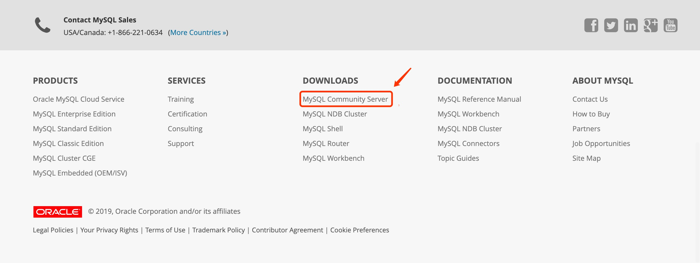
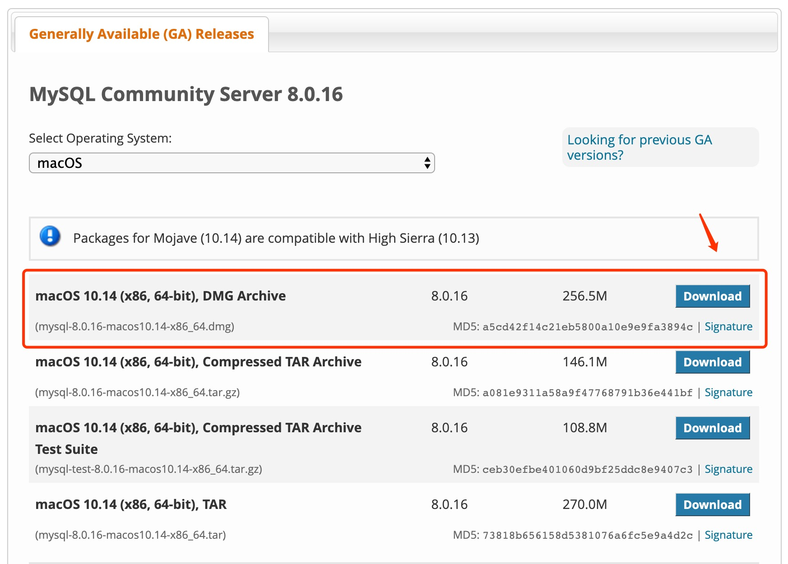
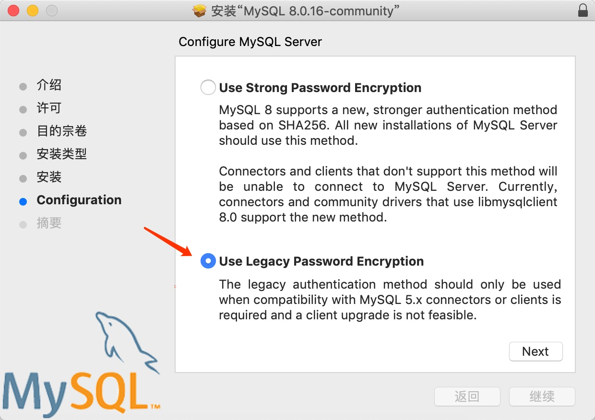
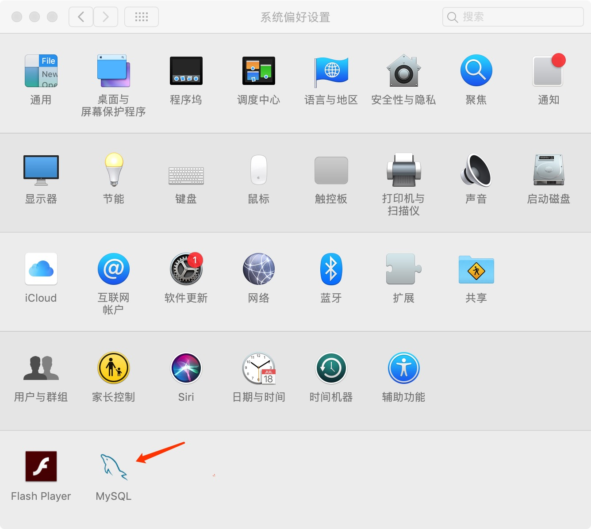
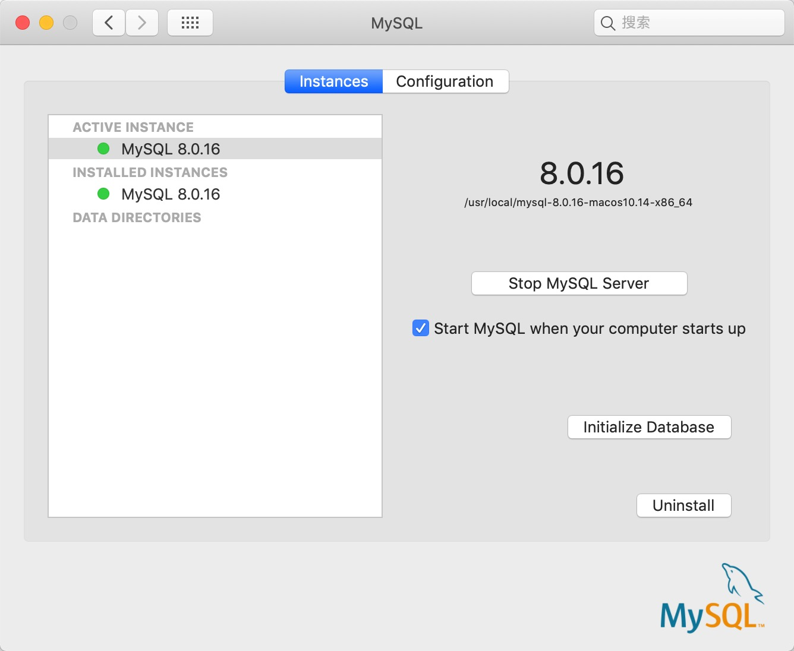

# 一、MacOS

## 1、官网下载

stips 1 -> 点击链接前往官网：<https://dev.mysql.com/>，滑至官网底部，选择 Mysql Community Server



stips 2 -> 选择对应版本：



stips 3 -> 在下载页面，选择最下面的：No thanks，just start my download.，进入下载状态。


stips 4 -> 安装：一路默认安装，中间有一步需要设置密码



stips 5 -> 设置密码，点击finish安装即可，注意密码长度至少8个字符

stips 6 -> 打开系统偏好设置，发现底部多了 mysql 选项



stips 7 -> 点击最下面的MySQL控制按钮，发现MySQL数据已经运行



在此可以启动和停止MySQL数据库。

## 2、brew

```shell
$ brew install mysql
```

## 3、配置

### 3.1. 环境变量

```shell
$ vim  ~/.bash_profile 
```

添加如下内容：

```shell
 PATH="$PATH":/usr/local/mysql/bin 
```

接下来需要source一下该文件，让刚刚设置的环境变量生效：

```shell
$ source ~/.bash_profile 
```

### 3.2. 生成配置文件

 在Mac系统中，安装完MySQL后，是没有自动生成MySQL的配置文件的，所以我们需要手动创建。

```shell
# 进入etc目录
$ cd /etc
# 创建my.cnf配置文件
$ touch my.cnf
# 修改文件权限
$ sudo chmod 664 my.cnf 
```

### 3.3. 登陆mysql

```shell
$ mysql -u root -p
Enter password: 
Welcome to the MySQL monitor.  Commands end with ; or \g.
Your MySQL connection id is 8
Server version: 8.0.16 MySQL Community Server - GPL

Copyright (c) 2000, 2019, Oracle and/or its affiliates. All rights reserved.

Oracle is a registered trademark of Oracle Corporation and/or its
affiliates. Other names may be trademarks of their respective
owners.

Type 'help;' or '\h' for help. Type '\c' to clear the current input statement.
```

输入指令：`show databases;` 这个命令后面一定要加分号，表示sql语句结束。这个命令用于表示显示默认安装的数据库，如下图显示安装成功。

```shell
mysql> show databases;
+--------------------+
| Database           |
+--------------------+
| information_schema |
| mysql              |
| performance_schema |
| sys                |
+--------------------+
4 rows in set (0.01 sec)
```

退出：`\q`

# 二、Windows


