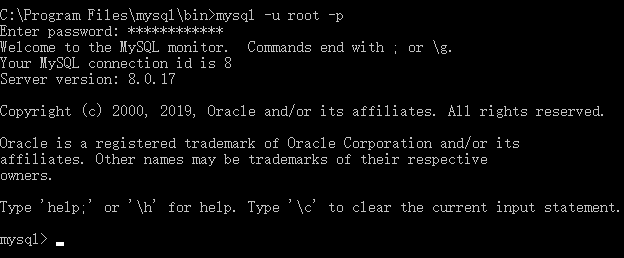
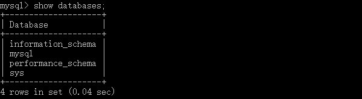

# 一、卸载

如果之前已经安装过mysql，请先确保彻底删除mysql相关文件之后再进行重新安装，彻底删除请参考[这篇文章](https://blog.csdn.net/howard789/article/details/83029008)

# 二、下载

## 1. 下载

点击链接前往官网：<https://dev.mysql.com/>，滑至官网底部，选择 Mysql Community Server


## 2. 选择版本

### 2.1. macOS 系统


### 2.2. Windows 系统


## 3. 进入下载状态

在下载页面，选择最下面的：No thanks，just start my download.，进入下载状态。


## 4. 安装

### 4.1. macOS 系统

 一路默认安装，中间有一步需要设置密码


设置密码，点击finish安装即可，注意密码长度至少8个字符

打开系统偏好设置，发现底部多了 mysql 选项


点击最下面的MySQL控制按钮，发现MySQL数据已经运行


在此可以启动和停止MySQL数据库。

### 4.2. Windows 系统

Mysql下载下来是一个压缩包，将其解压至指定目录，比如：“C:\Program Files” ，解压之后会看到如下文件：


# 三、应用

## 1. macOS 系统

### 1.1. 环境变量

```shell
$ vim  ~/.bash_profile 
```

添加路径：

```shell
$ PATH="$PATH":/usr/local/mysql/bin 
```

刷新配置文件：

```shell
$ source ~/.bash_profile 
```

### 1.2.  配置文件

 在Mac系统中，安装完MySQL后，是没有自动生成MySQL的配置文件的，所以我们需要手动创建。

```shell
# 进入etc目录
$ cd /etc
# 创建my.cnf配置文件
$ touch my.cnf
# 修改文件权限
$ sudo chmod 664 my.cnf 
```

### 1.3. 登陆

```shell
$ mysql -u root -p
Enter password: 
Welcome to the MySQL monitor.  Commands end with ; or \g.
Your MySQL connection id is 10
Server version: 8.0.16 MySQL Community Server - GPL

Copyright (c) 2000, 2019, Oracle and/or its affiliates. All rights reserved.

Oracle is a registered trademark of Oracle Corporation and/or its
affiliates. Other names may be trademarks of their respective
owners.

Type 'help;' or '\h' for help. Type '\c' to clear the current input statement.

mysql> 
```

### 1.4. 验证

```mysql
mysql> SHOW DATABASES;
+--------------------+
| Database           |
+--------------------+
| db_test            |
| information_schema |
| mysql              |
| performance_schema |
| test_db            |
+--------------------+
5 rows in set (0.12 sec)
```

## 2. Windows 系统

https://blog.csdn.net/u012868901/article/details/81099022

### 2.1. 环境变量

在“此电脑”上鼠标右键选中“属性” -> 点击“高级系统设置” -> 点击“环境变量” -> 在系统变量下点击“新建” -> 设置变量名和值 -> 点击确定保存

> 提示：变量值为mysql保存路径。


接下来在系统变量“Path”字段下点击编辑 -> 新建 -> 设置值 -> 确定：


至此，环境变量配置完成。

### 2.2. 配置文件

在安装目录下创建my.ini文件，内容如下:

```ini
# 【客户端】
[client]
# 设置mysql客户端连接服务端时默认使用的端口
port=3306
socket = /tmp/mysql.sock
default-character-set=utf8
# tips：可以设置账号密码直接登录
# username=账号
# password=密码
[mysql]
# 设置mysql客户端默认字符集
default-character-set=utf8


# 【服务端】
[mysqld]
# 设置监听mysql的端口号
port=3306
socket = /tmp/mysql.sock
# 设置mysql安装目录(所有的路径都是作为这个路径的相对路径)
basedir=C:\Program Files\mysql
# 设置mysql数据库数据的存放目录
datadir=C:\Program Files\mysql\data
# 设置新建表时默认的字编码
character-set-server=utf8

# 设置新建表时默认的存储引擎
default-storage-engine=INNODB
# 设置服务端允许并发的最大连接数
max_connections=200
# 允许连接失败的次数。这是为了防止有人从该主机试图攻击数据库系统
max_connect_errors=10
```

### 2.3. 启动服务

stips 1 -> 以管理员身份运行终端：


stips 2 ->初始化mysql 

```shell
$ mysqld --initialize --user=root --console
```

执行 MySQL 初始化命令，在 MySQL 目录下生成 data 文件夹，如图所示。


> 提示：如果动作太快或者忘记了密码，可以删除data文件，重新初始化mysql。

stips 3 -> cd 进入到mysql的bin目录，通过下方指令安装服务

```shell
$ mysqld --install 
```


> 提示：如果在执行指令的过程中，遇到”msvcp140.dll“的问题，通过点击[这里](https://zhidao.baidu.com/question/1577810098422037180.html)解决。

stips 4 -> 启动mysql服务

```shell
$ net start mysql
```


### 2.4. 登陆

```shell
$ mysql -u root -p
```



> 提示：如果出现 ”Access denied for user 'root'@'localhost' (using password: YES)“ 可参考 [这里](https://www.jb51.net/article/158286.htm)

### 2.5. 修改密码

```shell
$ ALTER USER <用户名>@<主机名> IDENTIFIED BY <密码>;
```


### 2.6. 验证



# 四、纠错

## 1.  => zsh: command not found: mysql

这是未添加环境变量的问题

```shell
$ vi ~/.zshrc
```

添加代码：

```
export PATH=${PATH}:/usr/local/mysql/bin
```

保存退出，执行如下代码：

```shell
$ source ~/.zshrc
```

之后就可以在zsh登录啦：

```shell
$ mysql -u root -p
```


