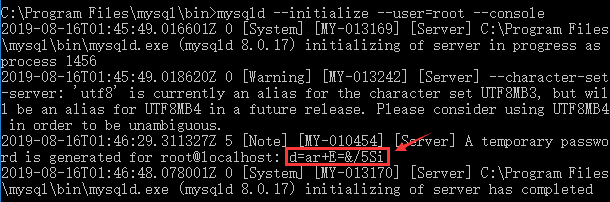

# 一、下载

## 1. 下载

点击链接前往官网：<https://dev.mysql.com/>，滑至官网底部，选择 Mysql Community Server


## 2. 选择版本

### 2.1. macOS 系统


### 2.2. Windows 系统


## 3. 进入下载状态

在下载页面，选择最下面的：No thanks，just start my download.，进入下载状态。


## 4. 安装

### 4.1. macOS 系统

 一路默认安装，中间有一步需要设置密码


设置密码，点击finish安装即可，注意密码长度至少8个字符

打开系统偏好设置，发现底部多了 mysql 选项


点击最下面的MySQL控制按钮，发现MySQL数据已经运行


在此可以启动和停止MySQL数据库。

### 4.2. Windows 系统

Mysql下载下来是一个压缩包，将其解压至指定目录，比如：“C:\Program Files” ，假牙之后会看到如下文件：


# 二、配置

## 1. macOS 系统

### 1.1. 配置环境变量

```shell
$ vim  ~/.bash_profile 
```

添加如下内容：

```shell
 PATH="$PATH":/usr/local/mysql/bin 
```

接下来需要source一下该文件，让刚刚设置的环境变量生效：

```shell
$ source ~/.bash_profile 
```

### 1.2.  生成配置文件

 在Mac系统中，安装完MySQL后，是没有自动生成MySQL的配置文件的，所以我们需要手动创建。

```shell
# 进入etc目录
$ cd /etc
# 创建my.cnf配置文件
$ touch my.cnf
# 修改文件权限
$ sudo chmod 664 my.cnf 
```

## 2. Windows 系统

### 2.1. 配置环境变量

在“此电脑”上鼠标右键选中“属性” -> 点击“高级系统设置” -> 点击“环境变量” -> 在系统变量下点击“新建” -> 设置变量名和值 -> 点击确定保存

> 提示：变量值为mysql保存路径。


接下来在系统变量“Path”字段下点击编辑 -> 新建 -> 设置值 -> 确定：


至此，环境变量配置完成。

### 2.2. 配置文件

首先可以看见安装目录下没有my.ini文件或者my-default.ini文件，于是自己在安装目录下创建一个my.ini文件，文件内容如下:

```ini
[mysqld]
# 设置端口号
port=3306
# 设置mysql的安装目录
basedir=C:\Program Files\mysql
# 设置mysql数据库的数据的存放目录
datadir=C:\Program Files\mysql\data
# 允许最大连接数
max_connections=200
# 允许连接失败的次数。这是为了防止有人从该主机试图攻击数据库系统
max_connect_errors=10
# 服务端使用的字符集默认为UTF8
character-set-server=utf8
# 创建新表时将使用的默认存储引擎
default-storage-engine=INNODB
# 默认使用“mysql_native_password”插件认证
default_authentication_plugin=mysql_native_password
[mysql]
# 设置mysql客户端默认字符集
default-character-set=utf8
[client]
# 设置mysql客户端连接服务端时默认使用的端口
port=3306
```

写好了配置文件之后，以管理员身份运行终端：


然后先给mysql服务创建名称(方便到时候建立多个mysql服务时不冲突)

```shell
mysqld --install mysql_test
```

名字可以根据自己的需要配置，接下来初始化mysql：

```shell
mysqld --initialize --console
```



接下来启动mysql服务：

```shell
net start mysql_test
```


# 三、登陆

```shell
$ mysql -u root -p
Enter password: 
Welcome to the MySQL monitor.  Commands end with ; or \g.
Your MySQL connection id is 8
Server version: 8.0.16 MySQL Community Server - GPL

Copyright (c) 2000, 2019, Oracle and/or its affiliates. All rights reserved.

Oracle is a registered trademark of Oracle Corporation and/or its
affiliates. Other names may be trademarks of their respective
owners.

Type 'help;' or '\h' for help. Type '\c' to clear the current input statement.
```

输入指令：`show databases;` 这个命令后面一定要加分号，表示sql语句结束。这个命令用于表示显示默认安装的数据库，如下图显示安装成功。

```shell
mysql> show databases;
+--------------------+
| Database           |
+--------------------+
| information_schema |
| mysql              |
| performance_schema |
| sys                |
+--------------------+
4 rows in set (0.01 sec)
```

退出：`\q`


