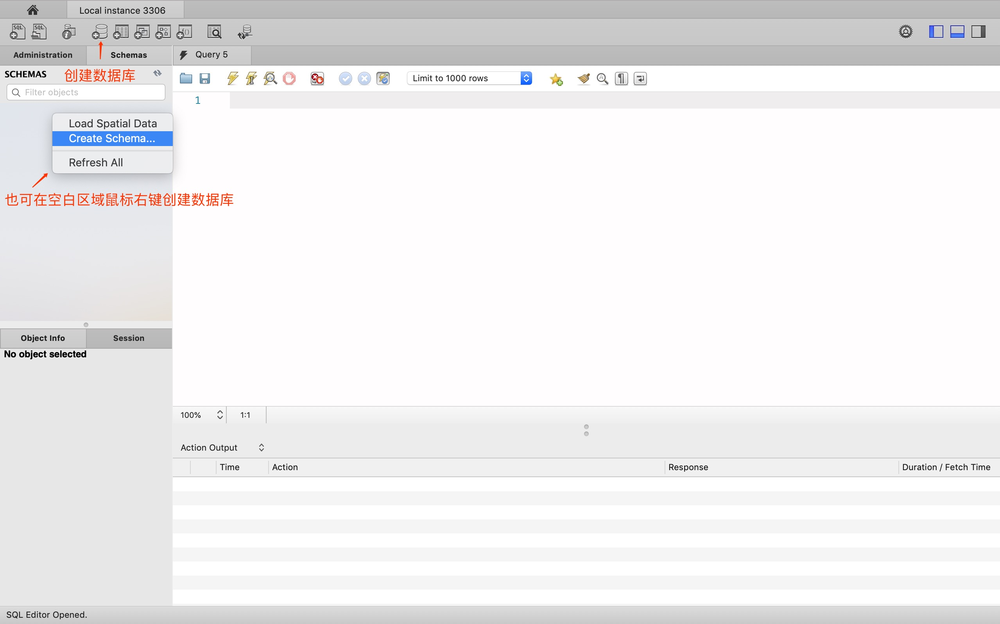
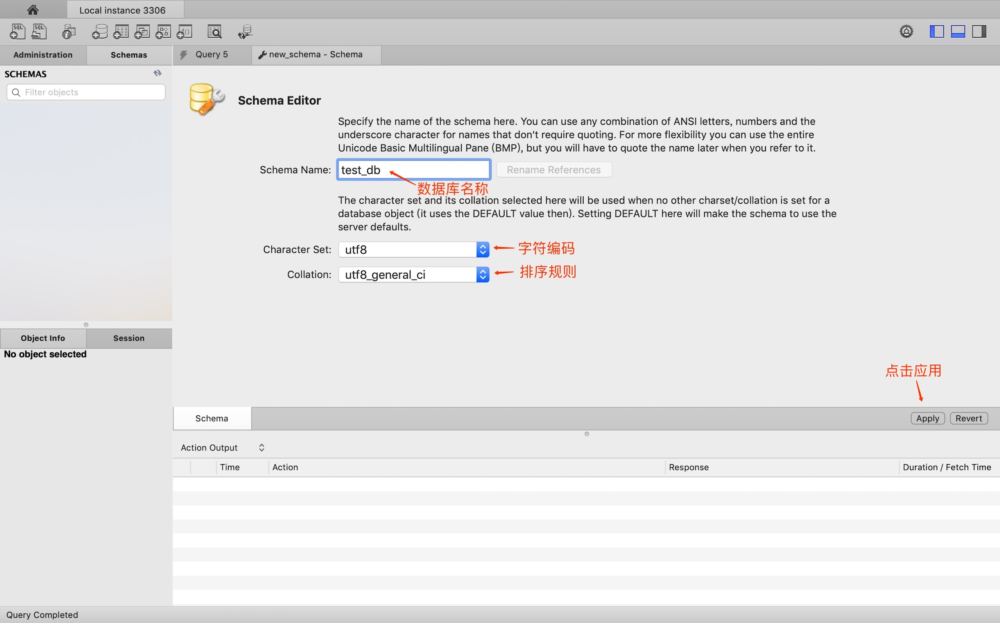

# # mySql

## @MacOS

### 1. 官网下载

stips 1 -> 点击链接前往官网：<https://dev.mysql.com/>，滑至官网底部，选择 Mysql Community Server


stips 2 -> 选择对应版本：


stips 3 -> 在下载页面，选择最下面的：No thanks，just start my download.，进入下载状态。


stips 4 -> 安装：一路默认安装，中间有一步需要设置密码


stips 5 -> 设置密码，点击finish安装即可，注意密码长度至少8个字符

stips 6 -> 打开系统偏好设置，发现底部多了 mysql 选项


stips 7 -> 点击最下面的MySQL控制按钮，发现MySQL数据已经运行


在此可以启动和停止MySQL数据库。

### 2. brew

```shell
$ brew install mysql
```

### 3. 使用终端

```shell
 PATH="$PATH":/usr/local/mysql/bin 
```

登录到mysql：

```shell
$ mysql -u root -p
Enter password: 
Welcome to the MySQL monitor.  Commands end with ; or \g.
Your MySQL connection id is 8
Server version: 8.0.16 MySQL Community Server - GPL

Copyright (c) 2000, 2019, Oracle and/or its affiliates. All rights reserved.

Oracle is a registered trademark of Oracle Corporation and/or its
affiliates. Other names may be trademarks of their respective
owners.

Type 'help;' or '\h' for help. Type '\c' to clear the current input statement.
```

输入指令：`show databases;` 这个命令后面一定要加分号，表示sql语句结束。这个命令用于表示显示默认安装的数据库，如下图显示安装成功。

```shell
mysql> show databases;
+--------------------+
| Database           |
+--------------------+
| information_schema |
| mysql              |
| performance_schema |
| sys                |
+--------------------+
4 rows in set (0.01 sec)
```

退出：`\q`

## @Windows

# # MySQL Workbench

MySQL Workbench 为数据库管理员、程序开发者和系统规划师提供可视化的Sql开发、数据库建模、以及数据库管理功能。

## 1. 下载

<https://dev.mysql.com/downloads/workbench/>

> 提示：选择对应版本进行下载

点击download之后，在跳转页面底部点击 ***No thanks, just start my download.***  进行下载。

## 2. 使用

\\. stips1：双击 Workbench 应用，选择链接，输入密码，点击ok


> 提示：当然你也可以点击+号，新建一个链接：

\\. stips2：创建数据库



在弹框中，再次点击apply



# # 配置

## 1. macOS

 在Mac系统中，安装完MySQL后，是没有自动生成MySQL的配置文件的，所以我们需要手动创建。

```shell
# 进入etc目录
$ cd /etc
# 创建my.cnf配置文件
$ touch my.cnf
# 修改文件权限
$ sudo chmod 664 my.cnf 
```

# # 链接

```shell
# 1. 链接数据库(输入密码)
$ mysql -u 用户名 -p 

# 2. 链接远程数据库
$ mysql -h ip地址 -u 用户名 -p
```

其他指令：

```js
// 1. 查看版本（连接后可以执行）
select version();

// 2. 显示当前时间（连接后可以执行）
select now();

// 3. 退出登录(断开连接)
quit 或 exit 或 \q
```


# # 指令

- `CREATE DATABASE <数据库名>`：创建数据库
- `DROP DATABASE <数据库名>`：删除数据库
- `USE <数据库名>`：选择数据库
- 


