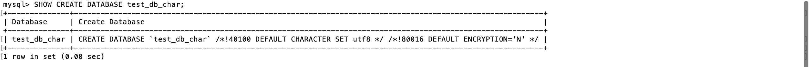
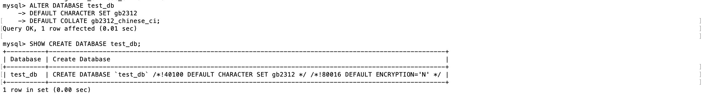

# 一、创建数据库

## 1. 语法

```mysql
CREATE DATABASE [IF NOT EXISTS] <数据库名> 
  [[DEFAULT] CHARACTER SET <字符集名>] |
  [[DEFAULT] COLLATE <校对规则名>];
```

语法解析：

- `[]` ：表示可选项。
- `IF NOT EXISTS`：在创建数据库之前进行判断，只有该数据库目前尚不存在时才能执行操作。此选项可以用来避免数据库已经存在而重复创建的错误。
- `[DEFAULT] CHARACTER SET`：指定数据库的默认字符集。
- `[DEFAULT COLLATE]`：指定字符集的默认排序规则。

## 2. 示例

**- 简单创建**

在 MySQL 中创建一个名为 test_db 的数据库：

```mysql
mysql> CREATE DATABASE test_db;
Query OK, 1 row affected (0.00 sec)
```

若再次输入上述语句，则系统会给出错误提示信息，如下所示：

```mysql
mysql> CREATE DATABASE test_db;
ERROR 1007 (HY000): Can't create database 'test_db'; database exists
```

> 提示：MySQL 不允许在同一系统创建两个相同名称的数据库。

如果加上 `IF NOT EXISTS` 从句，则可以避免类似错误，如下所示：

```mysql
mysql> CREATE DATABASE IF NOT EXISTS test_db;
Query OK, 1 row affected, 1 warning (0.00 sec)
```

**- 创建 MySQL 数据库时指定字符集和校对规则**

使用 MySQL 命令行工具创建一个测试数据库，命名为 test_db_char，指定其默认字符集为 utf8，默认校对规则为 utf8_chinese_ci（简体中文，不区分大小写），输入的 SQL 语句与执行结果如下所示：

```shell
mysql> CREATE DATABASE test_db_char
    -> DEFAULT CHARACTER SET utf8
    -> DEFAULT COLLATE utf8_general_ci;
Query OK, 1 row affected, 2 warnings (0.01 sec)
```

这时，可以使用 `SHOW CREATE DATABASE` 查看 test_db_char 数据库的定义声明，发现该数据库的指定字符集为 utf8，运行结果如下图所示：



为防止字符混乱的情况发生，MySQL 有时需要在创建数据库时明确指定字符集；在中国大陆地区，常用的字符集有 utf8 和 gbk。

- utf8 能够存储全球的所有字符，在任何国家都可以使用，默认的校对规则为 utf8_general_ci，对于中文可以使用 utf8_general_ci。
- gbk 只能存储汉语涉及到的字符，不具有全球通用性，默认的校对规则为 gbk_chinese_ci。

# 二、查看数据库

## 1. 语法

```mysql
SHOW DATABASES [LIKE '数据库名'];
```

语法说明如下：

- LIKE 从句是可选项，用于匹配指定的数据库名称。LIKE 从句可以部分匹配，也可以完全匹配。
- 数据库名由单引号`' '`包围。

## 2. 示例

**-> 查看所有数据库**

列出当前用户可查看的所有数据库：

```mysql
mysql> SHOW DATABASES;
+--------------------+
| Database           |
+--------------------+
| information_schema |
| mysql              |
| performance_schema |
| test_db            |
| test_db_char       |
+--------------------+
5 rows in set (0.01 sec)
```

**-> 使用LIKE语句**

先创建三个数据库，名字分别为 test_db、db_test、db_test_db。

1）使用 LIKE 从句，查看与 test_db 完全匹配的数据库：

```mysql
mysql> SHOW DATABASES LIKE 'test_db';
+--------------------+
| Database (test_db) |
+--------------------+
| test_db            |
+--------------------+
1 row in set (0.01 sec)
```

2）使用 LIKE 从句，查看名字中包含 test 的数据库：

```mysql
mysql> SHOW DATABASES LIKE '%test%';
+-------------------+
| Database (%test%) |
+-------------------+
| db_test           |
| db_test_db        |
| test_db           |
+-------------------+
3 rows in set (0.00 sec)
```

3）使用 LIKE 从句，查看名字以 db 开头的数据库：

```mysql
mysql> SHOW DATABASES LIKE 'test%';
+------------------+
| Database (test%) |
+------------------+
| test_db          |
+------------------+
1 row in set (0.00 sec)
```

4）使用 LIKE 从句，查看名字以 db 结尾的数据库：

```mysql
mysql> SHOW DATABASES LIKE '%test';
+------------------+
| Database (%test) |
+------------------+
| db_test          |
+------------------+
1 row in set (0.00 sec)
```

# 三、修改数据库

## 1. 语法

可以使用 ALTER DATABASE 或 ALTER SCHEMA 语句来修改已经被创建或者存在的数据库的相关参数。修改数据库的语法格式为：

```mysql
ALTER DATABASE|SCHEMA [数据库名] 
	[ DEFAULT ] CHARACTER SET <字符集名> |
	[ DEFAULT ] COLLATE <校对规则名>

```

语法说明如下：

- ALTER DATABASE 用于更改数据库的全局特性。这些特性存储在数据库目录的 db.opt 文件中。
- 使用 ALTER DATABASE 需要获得数据库 ALTER 权限。
- 数据库名称可以忽略，此时语句对应于默认数据库。
- CHARACTER SET 子句用于更改默认的数据库字符集。

## 2. 示例

**-> 修改数据库的字符集**

查看 test_db 数据库的定义声明的执行结果如下所示：


使用命令行工具将数据库 test_db 的指定字符集修改为 gb2312，默认校对规则修改为 utf8_unicode_ci，输入 SQL 语句与执行结果如下所示：



# 四、删除数据库

## 1. 语法

```mysql
DROP DATABASE [ IF EXISTS ] <数据库名>
```

语法说明如下：

- <数据库名>：指定要删除的数据库名。
- IF EXISTS：用于防止当数据库不存在时发生错误。
- DROP DATABASE：删除数据库中的所有表格并同时删除数据库。使用此语句时要非常小心，以免错误删除。如果要使用 DROP DATABASE，需要获得数据库 DROP 权限。

> 注意：MySQL 安装后，系统会自动创建名为 information_schema 和 mysql 的两个系统数据库，系统数据库存放一些和数据库相关的信息，如果删除了这两个数据库，MySQL 将不能正常工作。

# 五、选择数据库

## 1. 语法

```mysql
USE <数据库名>;
```

## 2. 示例

```mysql
mysql> SHOW DATABASES;
+--------------------+
| Database           |
+--------------------+
| db_test            |
| db_test_db         |
| information_schema |
| mysql              |
| performance_schema |
| test_db            |
+--------------------+
6 rows in set (0.00 sec)

mysql> USE test_db;
Database changed
```


