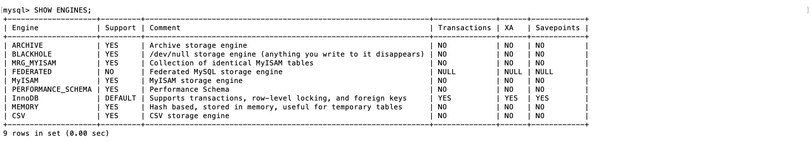
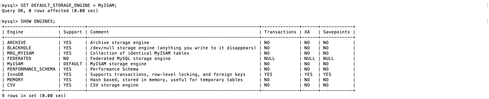

# 一、什么是存储引擎？

数据库存储引擎是数据库底层软件组件，数据库管理系统使用数据引擎进行创建、查询、更新和删除数据操作。不同的存储引擎提供不同的存储机制、索引技巧、锁定水平等功能，使用不同的存储引擎还可以获得特定的功能。

现在许多数据库管理系统都支持多种不同的存储引擎。MySQL 的核心就是存储引擎。

提示：`InnoDB` 事务型数据库的首选引擎，支持事务安全表（ACID），支持行锁定和外键。MySQL 5.5.5 之后，InnoDB 作为默认存储引擎。

# 二、MySQL 支持的存储引擎

MySQL 支持多种类型的数据库引擎，可分别根据各个引擎的功能和特性为不同的数据库处理任务提供各自不同的适应性和灵活性。在 MySQL 中，可以利用 `SHOW ENGINES` 语句来显示可用的数据库引擎和默认引擎。



Support 列的值表示某种引擎是否能使用，`YES`表示可以使用，`NO`表示不能使用，`DEFAULT`表示该引擎为当前默认的存储引擎。

MySQL 提供了多个不同的存储引擎，包括处理事务安全表的引擎和处理非事务安全表的引擎。在 MySQL 中，不需要在整个服务器中使用同一种存储引擎，针对具体的要求，可以对每一个表使用不同的存储引擎。

# 三、如何选择 MySQL 存储引擎

不同的存储引擎都有各自的特点，以适应不同的需求，如表所示。为了做出选择，首先要考虑每一个存储引擎提供了哪些不同的功能。

| 功能         | MylSAM | MEMORY | InnoDB | Archive |
| ------------ | ------ | ------ | ------ | ------- |
| 存储限制     | 256TB  | RAM    | 64TB   | None    |
| 支持事务     | No     | No     | Yes    | No      |
| 支持全文索引 | Yes    | No     | No     | No      |
| 支持树索引   | Yes    | Yes    | Yes    | No      |
| 支持哈希索引 | No     | Yes    | No     | No      |
| 支持数据缓存 | No     | N/A    | Yes    | No      |
| 支持外键     | No     | No     | Yes    | No      |

可以根据以下的原则来选择 MySQL 存储引擎：

- 如果要提供提交、回滚和恢复的事务安全（ACID 兼容）能力，并要求实现并发控制，InnoDB 是一个很好的选择。
- 如果数据表主要用来插入和查询记录，则 MyISAM 引擎提供较高的处理效率。
- 如果只是临时存放数据，数据量不大，并且不需要较高的数据安全性，可以选择将数据保存在内存的 MEMORY 引擎中，MySQL 中使用该引擎作为临时表，存放查询的中间结果。
- 如果只有 INSERT 和 SELECT 操作，可以选择Archive 引擎，Archive 存储引擎支持高并发的插入操作，但是本身并不是事务安全的。Archive 存储引擎非常适合存储归档数据，如记录日志信息可以使用 Archive 引擎。

> 提示：使用哪一种引擎要根据需要灵活选择，一个数据库中多个表可以使用不同的引擎以满足各种性能和实际需求。使用合适的存储引擎将会提高整个数据库的性能。

# 四、MySQL默认引擎

InnoDB 是系统的默认引擎，支持可靠的事务处理。

使用下面的语句可以修改数据库临时的默认存储引擎

```shell
SET default_storage_engine=< 存储引擎名 >
```

例如，将 MySQL 数据库的临时默认存储引擎修改为 MyISAM，输入的 SQL 语句和运行结果如图所示。



此时，可以发现 MySQL 的默认存储引擎已经变成了 MyISAM。但是当再次重启客户端时，默认存储引擎仍然是 InnoDB。

