# 一、插入数据

数据库与表创建成功以后，需要向数据库的表中插入数据。在mysql中可以使用 `INSERT` 语句向数据库已有的表中插入一行或者多行元组数据。

## 1. 语法

INSERT 语句有两种语法形式，分别是 `INSERT…VALUES` 语句和 `INSERT…SET` 语句。

### 1.1. INSERT…VALUES语句

```mysql
INSERT INTO <表名> [<列名1> [, ...<列名n>]]
VALUES (值1) [, ...(值n) ];
```

语法说明如下。

- `<表名>`：指定被操作的表名。
- `<列名>`：指定需要插入数据的列名。若向表中的所有列插入数据，则全部的列名均可以省略，直接采用 INSERT<表名>VALUES(…) 即可。
- `VALUES` 或 `VALUE` 子句：该子句包含要插入的数据清单。数据清单中数据的顺序要和列的顺序相对应。

### 1.2. INSERT…SET语句

```mysql
INSERT INTO <表名>
SET <列名1> = <值1>,
    <列名2> = <值2>,
        …
```

此语句用于直接给表中的某些列指定对应的列值，即要插入的数据的列名在 SET 子句中指定，col_name 为指定的列名，等号后面为指定的数据，而对于未指定的列，列值会指定为该列的默认值。

由 INSERT 语句的两种形式可以看出：

- 使用 INSERT…VALUES 语句可以向表中插入一行数据，也可以插入多行数据；
- 使用 INSERT…SET 语句可以指定插入行中每列的值，也可以指定部分列的值；
- INSERT…SELECT 语句向表中插入其他表的数据。
- 采用 INSERT…SET 语句可以向表中插入部分列的值，这种方式更为灵活；
- INSERT…VALUES 语句可以一次插入多条数据。

在 MySQL 中，用单条 INSERT 语句处理多个插入要比使用多条 INSERT 语句更快。

当使用单条 INSERT 语句插入多行数据的时候，只需要将每行数据用圆括号括起来即可。

## 2. 向表中的全部字段加入值

新建一个英雄列表，如下所示：

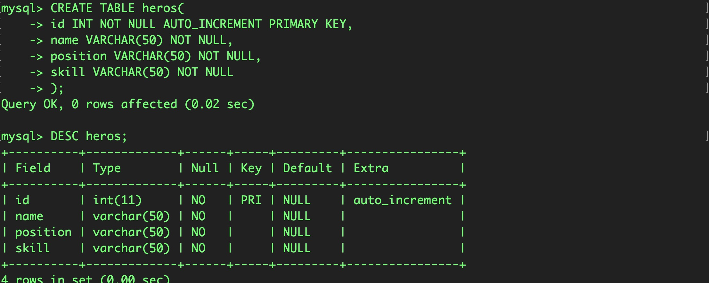

向表中所有字段插入值的方法有两种：一种是指定所有字段名；另一种是完全不指定字段名。

【实例 1】在 heros 表中插入一条新记录，如下所示：

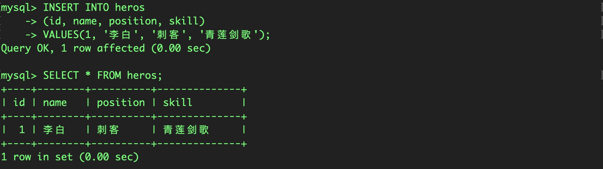

【实例 2】可以不指定列名称，直接指定VALUE。

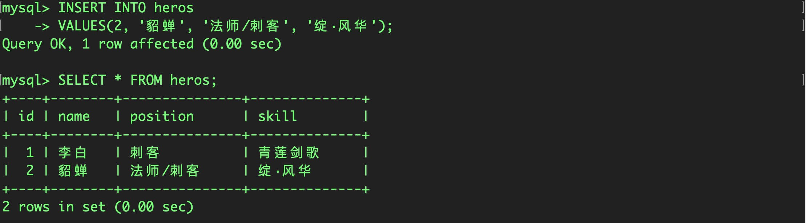

【实例 3】插入数据时，列名顺序不一定和创建表时一致，但是赋值时必须保持一致。

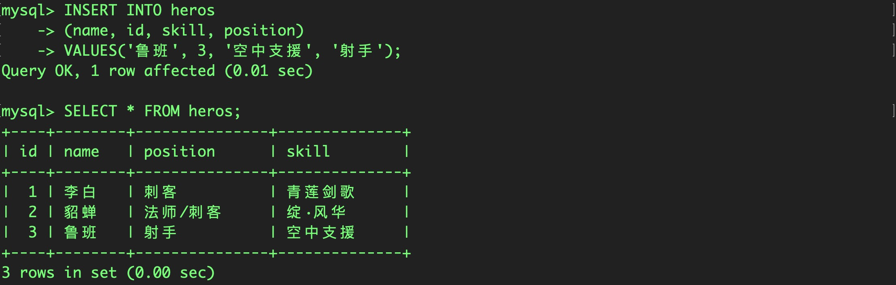

> 提示：虽然使用 INSERT 插入数据时可以忽略插入数据的列名称，若值不包含列名称，则 VALUES 关键字后面的值不仅要求完整，而且顺序必须和表定义时列的顺序相同。如果表的结构被修改，对列进行增加、删除或者位置改变操作，这些操作将使得用这种方式插入数据时的顺序也同时改变。如果指定列名称，就不会受到表结构改变的影响。

## 3. 向表中指定字段添加值

为表的指定字段插入数据，是在 INSERT 语句中只向部分字段中插入值，而其他字段的值为表定义时的默认值。

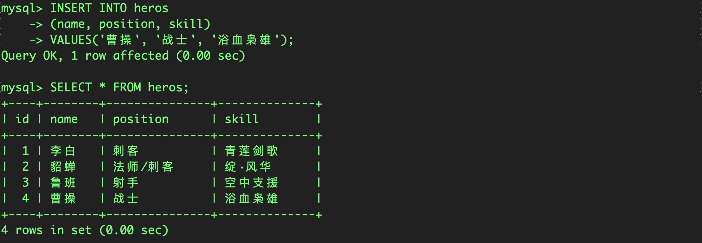

可以看到插入记录成功。如查询结果显示，这里的 id 字段自动添加了一个整数值 4。这时的 id 字段为表的主键，不能为空，系统自动为该字段插入自增的序列值。在插入记录时，如果某些字段没有指定插入值，MySQL 将插入该字段定义时的默认值。

## 4. 使用 INSERT INTO…FROM 语句复制表数据

INSERT INTO…SELECT…FROM 语句用于快速地从一个或多个表中取出数据，并将这些数据作为行数据插入另一个表中。

SELECT 子句返回的是一个查询到的结果集，INSERT 语句将这个结果集插入指定表中，结果集中的每行数据的字段数、字段的数据类型都必须与被操作的表完全一致。

在数据库 test_db 中创建一个与 heros 表结构相同的数据表 heros_new，创建表的 SQL 语句和执行过程如下所示。

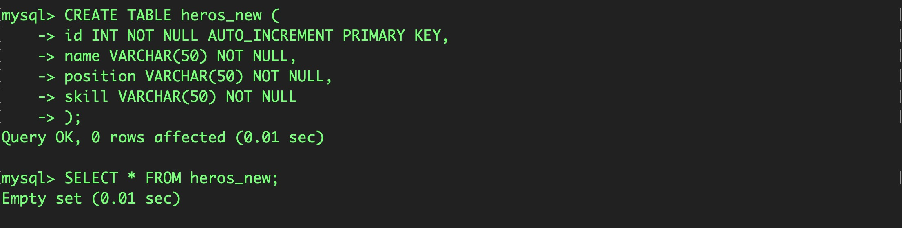

从 heros 表中查询所有的记录，并将其插入 heros_new 表中。输入的 SQL 语句和执行结果如下所示。

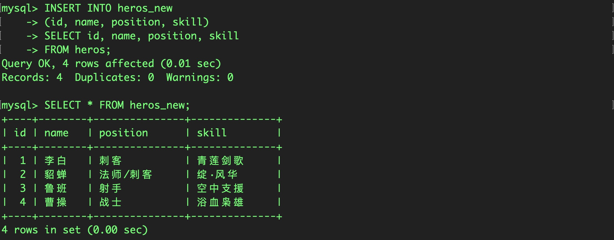

# 二、修改数据

在mysql中，可以使用 UPDATE 语句来修改、更新一个或多个表的数据。

```mysql
UPDATE <表名> SET 字段1=值1 [, 字段2=值2... ] [WHERE 子句 ]
[ORDER BY 子句] [LIMIT 子句]
```

语法解读：

- `<表名>`：用于指定要更新的表名称。
- `SET` 子句：用于指定表中要修改的列名及其列值。其中，每个指定的列值可以是表达式，也可以是该列对应的默认值。如果指定的是默认值，可用关键字 DEFAULT 表示列值。
- `WHERE` 子句：可选项。用于限定表中要修改的行。若不指定，则修改表中所有的行。
- `ORDER BY` 子句：可选项。用于限定表中的行被修改的次序。
- `LIMIT` 子句：可选项。用于限定被修改的行数。

> 注意：修改一行数据的多个列值时，SET 子句的每个值用逗号分开即可。

## 1. 修改表中给的数据

将heros表中的position列全部修改为“未知”

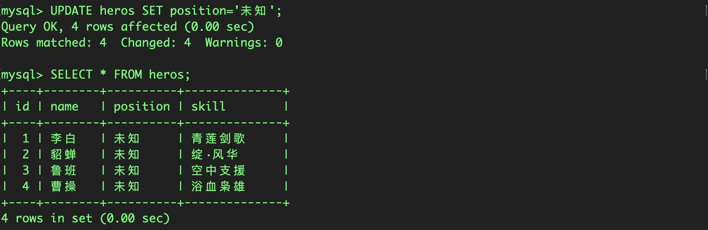

## 2. 根据条件修改表中的数据

在heros表中，更新id为4的行数据，将name修改为达摩，将skil修改为真言·普渡，输入的 SQL 语句和执行结果如下所示：

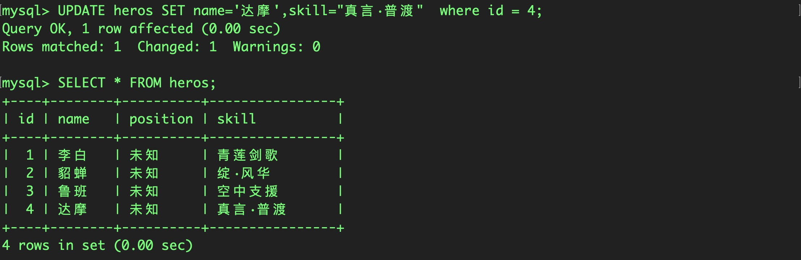

> 注意：保证 UPDATE 以 WHERE 子句结束，通过 WHERE 子句指定被更新的记录所需要满足的条件，如果忽略 WHERE 子句，MySQL 将更新表中所有的行。

# 三、删除数据

在mysql中，可以使用 DELETE 语句来删除表的一行或者多行数据。语法形式如下：

```mysql
DELETE FROM <表名> [WHERE 子句] [ORDER BY 子句] [LIMIT 子句]
```

语法说明如下：

- `<表名>`：指定要删除数据的表名。
- `ORDER BY` ：可选项。表示删除时，表中各行将按照子句中指定的顺序进行删除。
- `WHERE` ：可选项。表示为删除操作限定删除条件，若省略该子句，则代表删除该表中的所有行。
- `LIMIT` ：可选项。用于告知服务器在控制命令被返回到客户端前被删除行的最大值。

> 注意：在不使用 WHERE 条件的时候，将删除所有数据。

## 1. 根据条件删除表中的数据

删除heros表中id为2的值，输入的 SQL 语句和执行结果如下所示：

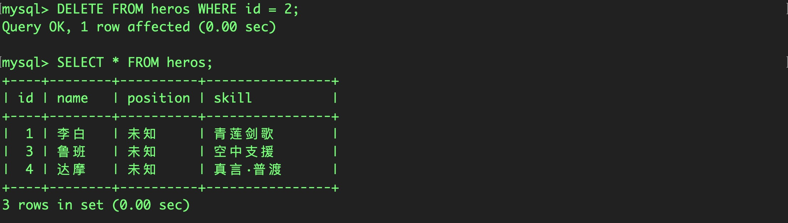

由运行结果可以看出，id 为 2 的记录已经被删除。

## 2. 删除表中的所有数据

在不使用 WHERE 条件的时候，将删除所有数据。

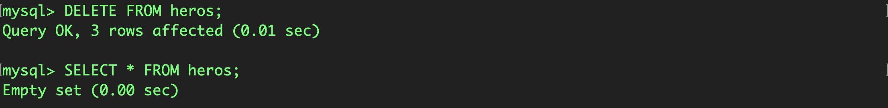