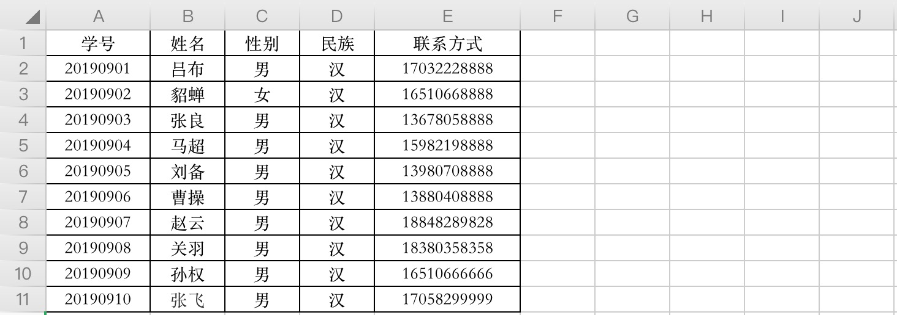

数据表用于在数据库中存储数据，在创建数据表之前，你需要通过 `USE db_name` 指定数据库。

# 一、创建数据表

```mysql
CREATE TABLE 表名 (
    属性名 数据类型 [完整约束条件],
    属性名 数据类型 [完整约束条件],
    ...
    属性名 数据类型 [完整约束条件]
);
```

【实例 01】创建数据表

```mysql
# 创建数据表
mysql> CREATE TABLE stus (
    -> id INT PRIMARY KEY AUTO_INCREMENT,
    -> name CHAR(20) NOT NULL,
    -> age INT CHECK(age >= 0 AND age <= 100) NOT NULL,
    -> gender CHAR(10) NOT NULL,
    -> origin CHAR(20) NOT NULL,
    -> major CHAR(20) NOT NULL,
    -> height FLOAT NOT NULL
    -> );
Query OK, 0 rows affected (0.03 sec)

# 查看已创建的数据表
mysql> SHOW TABLES;
+-------------------+
| Tables_in_db_stus |
+-------------------+
| stus              |
+-------------------+
1 row in set (0.01 sec)

# 查看指定数据表结构
mysql> DESC stus;
+--------+----------+------+-----+---------+----------------+
| Field  | Type     | Null | Key | Default | Extra          |
+--------+----------+------+-----+---------+----------------+
| id     | int(11)  | NO   | PRI | NULL    | auto_increment |
| name   | char(20) | NO   |     | NULL    |                |
| age    | int(11)  | NO   |     | NULL    |                |
| gender | char(10) | NO   |     | NULL    |                |
| origin | char(20) | NO   |     | NULL    |                |
| major  | char(20) | NO   |     | NULL    |                |
| height | float    | NO   |     | NULL    |                |
+--------+----------+------+-----+---------+----------------+
7 rows in set (0.01 sec)
```

# 二、修改数据表

常用的语法格式如下：

```mysql
ALTER TABLE <表名> [修改选项]
```

## 1. 添加字段

```mysql
ALTER TABLE <表名> ADD <新字段名> <数据类型> [约束条件] [FIRST|AFTER 已存在的字段名];
```

- `新字段名`为需要添加的字段的名称；
- `FIRST` 为可选参数，其作用是将新添加的字段设置为表的第一个字段；
- `AFTER` 为可选参数，其作用是将新添加的字段添加到指定的`已存在的字段名`的后面。

【实例 02】在stus表中major后面添加school字段，示例如下：

```mysql
mysql> ALTER TABLE stus 
    -> ADD school CHAR(20) NOT NULL AFTER major;
Query OK, 0 rows affected (0.03 sec)
Records: 0  Duplicates: 0  Warnings: 0

mysql> DESC stus;
+--------+----------+------+-----+---------+----------------+
| Field  | Type     | Null | Key | Default | Extra          |
+--------+----------+------+-----+---------+----------------+
| id     | int(11)  | NO   | PRI | NULL    | auto_increment |
| name   | char(20) | NO   |     | NULL    |                |
| age    | int(11)  | NO   |     | NULL    |                |
| gender | char(10) | NO   |     | NULL    |                |
| origin | char(20) | NO   |     | NULL    |                |
| major  | char(20) | NO   |     | NULL    |                |
| school | char(20) | NO   |     | NULL    |                |
| height | float    | NO   |     | NULL    |                |
+--------+----------+------+-----+---------+----------------+
8 rows in set (0.00 sec)
```

> 提示：“FIRST 或 AFTER 已存在的字段名”用于指定新增字段在表中的位置，如果 SQL 语句中没有这两个参数，则默认将新添加的字段设置为数据表的最后列。

## 2. 修改字段类型

```mysql
ALTER TABLE <表名> MODIFY <字段名> <数据类型>;
```

- `表名`指要修改数据类型的字段所在表的名称
- `字段名`指需要修改的字段
- `数据类型`指修改后字段的新数据类型。

【实例 03】修改school数据类型为text

```mysql
mysql> ALTER TABLE stus MODIFY school TEXT;
Query OK, 0 rows affected (0.04 sec)
Records: 0  Duplicates: 0  Warnings: 0

mysql> DESC stus;
+--------+----------+------+-----+---------+----------------+
| Field  | Type     | Null | Key | Default | Extra          |
+--------+----------+------+-----+---------+----------------+
| id     | int(11)  | NO   | PRI | NULL    | auto_increment |
| name   | char(20) | NO   |     | NULL    |                |
| age    | int(11)  | NO   |     | NULL    |                |
| gender | char(10) | NO   |     | NULL    |                |
| origin | char(20) | NO   |     | NULL    |                |
| major  | char(20) | NO   |     | NULL    |                |
| school | text     | YES  |     | NULL    |                |
| height | float    | NO   |     | NULL    |                |
+--------+----------+------+-----+---------+----------------+
8 rows in set (0.00 sec)
```

## 3. 删除字段

```mysql
ALTER TABLE <表名> DROP <字段名>；
```
【实例 04】删除school字段：
```mysql
mysql> ALTER TABLE stus DROP school;
Query OK, 0 rows affected (0.04 sec)
Records: 0  Duplicates: 0  Warnings: 0

mysql> DESC stus;
+--------+----------+------+-----+---------+----------------+
| Field  | Type     | Null | Key | Default | Extra          |
+--------+----------+------+-----+---------+----------------+
| id     | int(11)  | NO   | PRI | NULL    | auto_increment |
| name   | char(20) | NO   |     | NULL    |                |
| age    | int(11)  | NO   |     | NULL    |                |
| gender | char(10) | NO   |     | NULL    |                |
| origin | char(20) | NO   |     | NULL    |                |
| major  | char(20) | NO   |     | NULL    |                |
| height | float    | NO   |     | NULL    |                |
+--------+----------+------+-----+---------+----------------+
7 rows in set (0.00 sec)
```

## 4. 修改字段名称

```mysql
ALTER TABLE <表名> CHANGE <旧字段名> <新字段名> <新数据类型>；
```

【实例 05】将gender修改成sex

```mysql
mysql> ALTER TABLE stus CHANGE gender sex CHAR(10) NOT NULL;
Query OK, 0 rows affected (0.01 sec)
Records: 0  Duplicates: 0  Warnings: 0

mysql> DESC stus;
+--------+----------+------+-----+---------+----------------+
| Field  | Type     | Null | Key | Default | Extra          |
+--------+----------+------+-----+---------+----------------+
| id     | int(11)  | NO   | PRI | NULL    | auto_increment |
| name   | char(20) | NO   |     | NULL    |                |
| age    | int(11)  | NO   |     | NULL    |                |
| sex    | char(10) | NO   |     | NULL    |                |
| origin | char(20) | NO   |     | NULL    |                |
| major  | char(20) | NO   |     | NULL    |                |
| height | float    | NO   |     | NULL    |                |
+--------+----------+------+-----+---------+----------------+
7 rows in set (0.00 sec)
```

> 提示：由于不同类型的数据在机器中的存储方式及长度并不相同，修改数据类型可能会影响数据表中已有的数据记录，因此，当数据表中已经有数据时，不要轻易修改数据类型。

## 5. 修改表名

```mysql
ALTER TABLE <旧表名> RENAME [TO] <新表名>;
RENAME TABLE <旧表名> TO <新表名>;
```

代码示例：将stus修改为stu_infos。

```mysql
mysql> ALTER TABLE stus RENAME stu_infos;
Query OK, 0 rows affected (0.03 sec)

mysql> SHOW TABLES;
+-------------------+
| Tables_in_test_db |
+-------------------+
| stu_infos         |
+-------------------+
1 row in set (0.01 sec)
```

# 三、删除数据表

```mysql
DROP TABLE [IF EXISTS] <表名> [ , <表名1> , <表名2>] …
```

```mysql
mysql> DROP TABLE stu_infos;
Query OK, 0 rows affected (0.02 sec)

mysql> SHOW TABLES;
+-------------------+
| Tables_in_test_db |
+-------------------+
| stu_infos         |
+-------------------+
1 row in set (0.00 sec)
```

# 四、约束

约束实际上就是表中数据的限制条件，表在设计的时候加入约束的目的就是为了保证表中的记录完整和有效，比如name字段中要让其用户名不重复，这就需要添加约束。或者必须注册的时候需要添加邮箱等。

| 约束条件       | 说明                                                   |
| -------------- | ------------------------------------------------------ |
| PRIMARY KEY    | 主键约束                                               |
| FOREIGN KEY    | 外键约束：标识该属性为该表的外键，是与之联系某表的主键 |
| NOT NULL       | 非空约束：属性值不能为空                               |
| UNIQUE         | 唯一约束：属性值具有唯一性，不可重复，但可以为null     |
| DEFAULT        | 默认值约束：为该属性设置默认值                         |
| CHECK          | 检查约束                                               |

查看表约束：具有唯一性，不可重复，但可以为null

```mysql
SHOW CREATE TABLE <表名>
```

## 1. 主键约束

表设计时一定要有主键。表中的某个字段添加主键约束后，该字段为主键字段，主键字段中出现的每一个数据都称为主键值。给某个字段添加主键约束之后，该字段不能重复也不能为空，效果和 ”NOT NULL UNIQUE” 约束相同，但是本质不同。主键约束除了可以做到 ”NOT NULL UNIQUE” 之外，还会默认添加”索引——index”。一张表应该有主键字段，如果没有，表示该表无效。

主键值是当前行数据的唯一标识、是当前行数据的身份证号。即使表中两行记录相关数据相同，但由于主键值不同，所以也认为是两行不同的记录。

按主键约束的字段数量分类，主键可分为单一组件和复合组件，无论是单一主键还是复合主键，一张表主键约束只能有一个(约束只能有一个，但可以作用到好几个字段)。

MySQL数据库提供了一个自增的数字（AUTO_INCREMENT），专门用来自动生成主键值，主键值不用用户维护，自动生成，自增数从1开始，以1递增。

## 2. 外键约束

设计数据库表，用来存储学生和成绩：


> 分析：这张表看起来比较复杂，我们可以把它拆分成两张表：

学员表：



> 提示：在学生表中，学号是主键

成绩表:


> 提示：在成绩表中，学号是主键，同时也是一个外键，关联的是学员表中的学号。

所以在设计的时候，就给表1添加一个外键，这个外键就是表2中的学号字段，那么这样表1就是主表，表2就是子表。所以结合2张表就能保持数据的一致性、完整性（估计就是还原成原来的那张大表吧）

```mysql
# 学生表
mysql> CREATE TABLE stus (
    -> num INT PRIMARY KEY NOT NULL,
    -> name VARCHAR(45) NOT NULL,
    -> gender VARCHAR(45) NOT NULL,
    -> national VARCHAR(45) NOT NULL,
    -> tel VARCHAR(45) NOT NULL
  	-> );
Query OK, 0 rows affected (0.05 sec)

# 成绩表
mysql> CREATE TABLE grades (
    -> num INT PRIMARY KEY NOT NULL,
    -> chinese FLOAT NOT NULL,
    -> math FLOAT NOT NULL,
    -> english FLOAT NOT NULL,
    -> liberal_arts FLOAT NOT NULL,
    -> science FLOAT NOT NULL,
    -> FOREIGN KEY(num) REFERENCES stus(num)
    -> );
Query OK, 0 rows affected (0.03 sec)
```


# 五、表相关指令总结

```mysql
# 1. 创建表
CREATE TABLE <表格名> ([列名 数据类型 约束条件],...);
# 2. 添加字段
ALTER TABLE <表格名> ADD <列名> <数据类型> <约束条件> [FIRST|AFTER];
# 3. 修改字段类型
ALTER TABLE <表格名> MODIFY <列名> <数据类型> <约束条件>;
# 4. 修改字段名称
ALTER TABLE <表格名> CHANGE <旧列名> <新列名> <数据类型> <约束条件>;
# 5. 删除字段
ALTER TABLE <表格名> DROP <列名>
# 6. 修改表名
ALTER TABLE <表格名> RENAME TO <新表名>
# 7. 删除表
DROP  TABLE <表格名>
```


