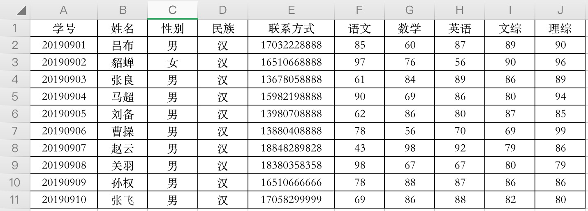
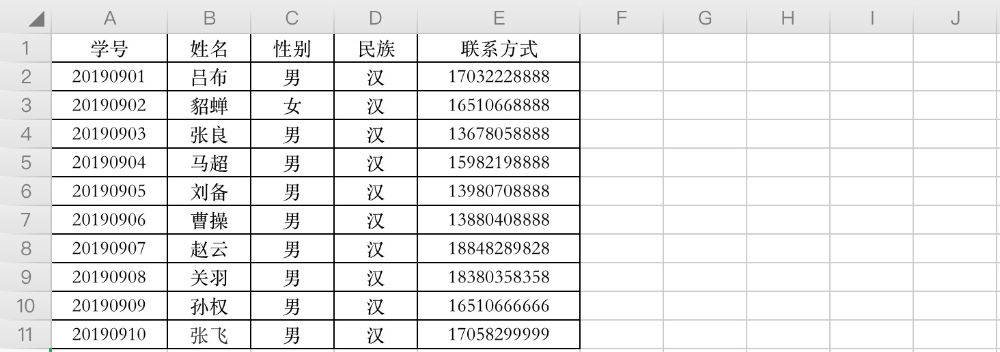
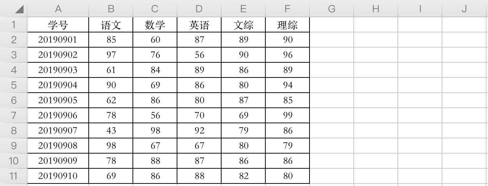

数据表用于在数据库中存储数据，在创建数据表之前，你需要通过 `USE db_name` 指定数据库。

# # 基本指令

- 创建表：`CREATE TABLE <table_name> (属性名 数据类型 [约束]...);`
- 查看表：`SHOW TABLES;`
- 查结构：`DESC <table_name>;`
- 查约束：`SHOW CREATE TABLE <table_name>;`
- 删除表：`DROP TABLE <table_name>;`
- 改表名：`ALTER TABLE <table_name> rename <新表名>;`
- 加字段：`ALTER TABLE <table_name> ADD <新字段名> <数据类型> [约束] [first/after];`
- 删字段：`ALTER TABLE <table_name> DROP <字段名>;`
- 改字段名：`ALTER TABLE <table_name> CHANGE <旧字段名> <新字段名> <数据类型>;`
- 改字段类型：`ALTER TABLE <table_name> MODIFY <字段名> <数据类型>;`

# # 约束

约束实际上就是表中数据的限制条件，表在设计的时候加入约束的目的就是为了保证表中的记录完整和有效，比如name字段中要让其用户名不重复，这就需要添加约束。或者必须注册的时候需要添加邮箱等。

- `PRIMARY KEY`：主键
- `FOREIGN KEY`：外键
- `NOT NULL`：非空
- `UNIQUE`：唯一
- `DEFAULT`：默认值
- `CHECK`：检查约束

## 1. 主键约束

表设计时一定要有主键。表中的某个字段添加主键约束后，该字段为主键字段，主键字段中出现的每一个数据都称为主键值。给某个字段添加主键约束之后，该字段不能重复也不能为空，效果和 ”NOT NULL UNIQUE” 约束相同，但是本质不同。主键约束除了可以做到 ”NOT NULL UNIQUE” 之外，还会默认添加”索引——index”。一张表应该有主键字段，如果没有，表示该表无效。

主键值是当前行数据的唯一标识、是当前行数据的身份证号。即使表中两行记录相关数据相同，但由于主键值不同，所以也认为是两行不同的记录。

按主键约束的字段数量分类，主键可分为单一组件和复合组件，无论是单一主键还是复合主键，一张表主键约束只能有一个(约束只能有一个，但可以作用到好几个字段)。

MySQL数据库提供了一个自增的数字（AUTO_INCREMENT），专门用来自动生成主键值，主键值不用用户维护，自动生成，自增数从1开始，以1递增。

## 2. 外键约束

设计数据库表，用来存储学生和成绩：



> 分析：这张表看起来比较复杂，我们可以把它拆分成两张表：

学员表：



> 提示：在学生表中，学号是主键

成绩表:



> 提示：在成绩表中，学号是主键，同时也是一个外键，关联的是学员表中的学号。

所以在设计的时候，就给表1添加一个外键，这个外键就是表2中的学号字段，那么这样表1就是主表，表2就是子表。所以结合2张表就能保持数据的一致性、完整性（估计就是还原成原来的那张大表吧）

```mysql
# 学生表
mysql> CREATE TABLE stus (
    -> num INT PRIMARY KEY NOT NULL,
    -> name VARCHAR(45) NOT NULL,
    -> gender VARCHAR(45) NOT NULL,
    -> national VARCHAR(45) NOT NULL,
    -> tel VARCHAR(45) NOT NULL
  	-> );
Query OK, 0 rows affected (0.05 sec)

# 成绩表
mysql> CREATE TABLE grades (
    -> num INT PRIMARY KEY NOT NULL,
    -> chinese FLOAT NOT NULL,
    -> math FLOAT NOT NULL,
    -> english FLOAT NOT NULL,
    -> liberal_arts FLOAT NOT NULL,
    -> science FLOAT NOT NULL,
    -> FOREIGN KEY(num) REFERENCES stus(num)
    -> );
Query OK, 0 rows affected (0.03 sec)
```
