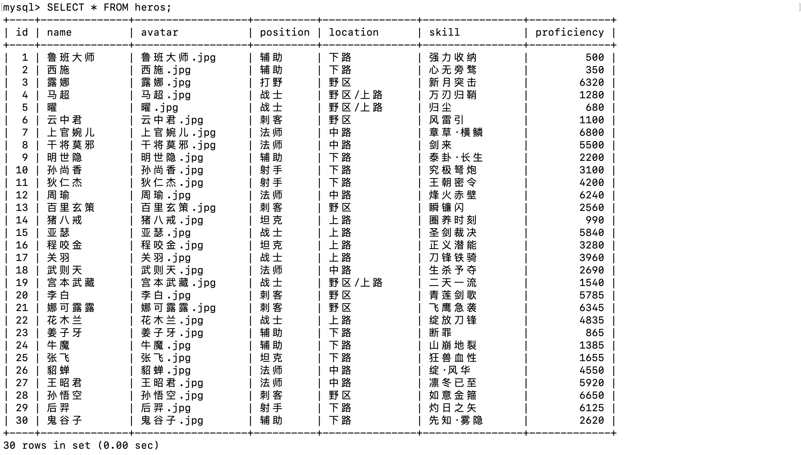

# 一、插入数据

```mysql
# 1. 指定列名赋值数据
INSERT INTO <table_name> (column1, column2, ...) VALUES (value1, value2, ...)
# 2. 逐一赋值数据
INSERT INTO <table_name> VALUES (value1, value2, ...);
# 3. 设置多行数据
INSERT INTO <表名> VALUES (value1, value2, ...), (value1, value2, ...);
```

# 二、修改数据

```mysql
UPDATE <表名> SET 列名=值  [WHERE 子句 ] [ORDER BY 子句] [LIMIT 子句]
```

# 三、删除数据

```mysql
DELETE FROM <表名> [WHERE 子句] [ORDER BY 子句] [LIMIT 子句]
```

# 四、查询数据

现数据表heros如下：



后续操作将依赖于这张表进行操作：

```mysql
# 1. 查询所有数据
SELECT * FROM heros;
# 2. 查询指定列的数据
SELECT name,skill... FROM heros;
```

## 1. 去重

```mysql
SELECT DISTINCT position FROM heros;
```

## 2. 设置别名

```mysql
SELECT name AS 英雄, skill AS 技能 FROM heros;
```

## 3. 限制

```mysql
 # 1. 前5行
 SELECT * FROM heros LIMIT 5;
 # 2. 从第2行开始查询5条数据(不包括第2行的数据)
 SELECT * FROM heros LIMIT 2,5;
```

## 4. 排序

```mysql
# 升序（默认）
SELECT * FROM <table_name> ORDER BY 列名 ASC; 
# 降序
SELECT * FROM <table_name> ORDER BY 列名 DESC; 
```

## 5. 条件查询

```mysql
# 1. 相等查询
SELECT * FROM heros WHERE id = 1;
# 2. 熟练度在5000~6000之间的英雄信息
SELECT * FROM heros WHERE proficiency BETWEEN 5000 AND 6000;
# 3. 多条件并列查询
SELECT * FROM heros WHERE location = '下路' AND position = '射手';
# 4. 查询空值
SELECT * FROM heros WHERE skill IS NULL;
```

WHERE 字句操作符：

| 操作符            | 说明                   |
| ----------------- | ---------------------- |
| =                 | 等于                   |
| <>                | 不等于                 |
| !=                | 不等于                 |
| <                 | 小于                   |
| <=                | 小于等于               |
| >                 | 大于                   |
| \>=               | 大于等于               |
| BETWEEN ...AND... | 在指定的两个值之间选择 |

> 提示：在同时使用 ORDER BY 和 WHERE 字句时，应该让ORDER BY位于 WHERE 之后，否则将会产生错误。

## 6. 数据过滤

```mysql
# ‘AND’操作符：组合 WHERE 字句
SELECT * FROM heros WHERE position = '法师' AND proficiency >= 6000;
# ‘OR’操作符：匹配任一条件
SELECT * FROM heros WHERE position = '法师' OR proficiency >= 6000;
# ‘IN’操作符：指定条件范围，类似于‘OR’操作符
SELECT * FROM heros WHERE name IN ('上官婉儿', '孙悟空');
# ‘NOT’操作符：排除后续条件
SELECT * FROM heros WHERE name NOT ('上官婉儿', '孙悟空');
```

> 提示：AND 和 OR 可以使用圆括号组合，控制其查询优先级。事实是，任何时候使用具有 AND 和 OR 操作符的 WHERE 字句，都应该使用圆括号明确地分组操作符。不要过分依赖默认计算次序，即使它确实是你想要的东西也是如此。使用圆括号没有什么坏处，它能消除歧义。

## 7. 通配符

```mysql
# 1. ’%‘ 匹配多个字符 ->查询姓李的数据
SELECT * FROM 表 WHERE name LIKE "李%";
# 2. ’_‘ 匹配一个字符 ->查询姓李的数据(名字只包括两个字)
SELECT * FROM 表 WHERE name LIKE "李_";
```

## 8. 正则表达式

```mysql
SELECT * FROM heros WHERE name REGEXP '^上官';
```


