MySQL Workbench 是可视化数据库设计软件，为数据库管理员和开发人员提供了一整套可视化的数据库操作环境，主要功能有数据库设计与模型建立、SQL 开发（取代 MySQL Query Browser）、数据库管理（取代 MySQL Administrator）。

# 一、下载

<https://dev.mysql.com/downloads/workbench/>

> 提示：选择对应版本进行下载

点击download之后，在跳转页面底部点击 ***No thanks, just start my download.***  进行下载。

# 二、操作数据库

## 1. 链接数据库

\\. stips1：双击 Workbench 应用，选择链接，输入密码，点击ok

> 提示：当然你也可以点击+号，新建一个链接

## 2. 页面介绍

## 3. 创建数据库

在 SCHEMAS 列表的空白处右击，选择“Create Schema…”，则可创建一个数据库，如下图所示。

在创建数据库的对话框中，在 Name 框中输入数据库的名称，在 Collation 下拉列表中选择数据库指定的字符集。单击 Apply 按钮，即可创建成功，如下图所示。

在创建数据库的对话框中设置完成之后，可以预览当前操作的 SQL 脚本，然后单击 Apply 按钮，最后在下一个弹出的对话框中直接单击 Finish 按钮，即可完成数据库 test_db 的创建，如下图所示。

## 4. 修改数据库

成功创建数据库后，可以修改数据库的字符集，在需要修改字符集的数据库上右击，选择“Alter Schema…”选项，即可修改数据库指定的字符集，如下图所示。

在修改数据库的对话框中，数据库的名称不可以修改，在 Collation 下拉列表中选择数据库需要修改为的字符集。单击 Apply 按钮，即可创建成功。

## 5. 删除数据库

可以在 SCHEMAS 列表中删除数据库，在需要删除的数据库上右击，选择“Drop Schema…”，如下图所示。

在弹出的对话框中单击 Drop Now 按钮，即可直接删除数据库。

若单击 Review SQL 按钮，则可以显示删除操作对应的 SQL 语句。单击 Execute 按钮就可以执行删除操作，如下图所示。

## 6. 默认数据库

在 SCHEMAS 列表中可以选择默认的数据库，在需要指定默认的数据库上右击，选择 Set As Default Schema，如下图所示。该操作相当于命令行工具中的 USE<database_name> 命令。

数据库 test_db 被设置为默认数据库之后，SCHEMAS 列表中的 test_db 字体会被加粗显示，如下图所示。

# 三、操作数据表

## 1. 创建数据表

打开 MySQL Workbench 软件，在 SCHEMAS 列表中展开当前默认的 test_db 数据库，在 Tables 菜单上右击，选择“Create Table…”，即可在 test_db 数据库中创建数据表，如下图所示。

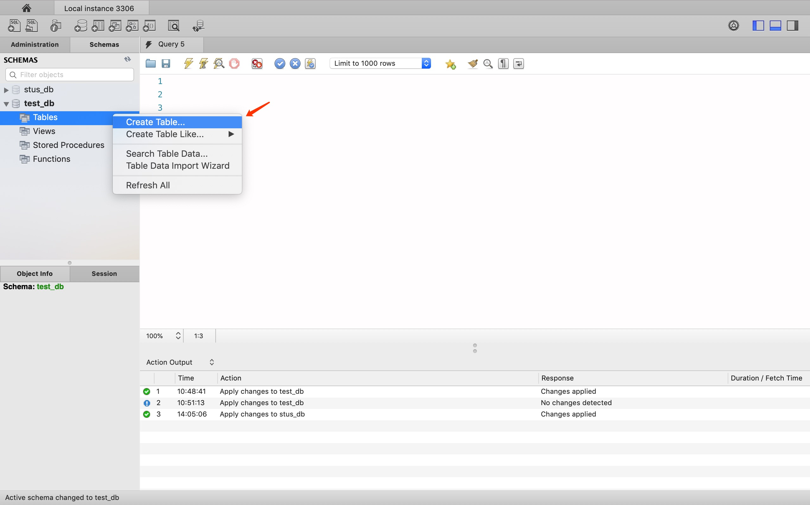

在创建数据表的对话框中，在 Table Name 框中输入数据表的名称，在图中的方框部分编辑数据表的列信息，编辑完成后，单击 Apply 按钮，即可成功创建数据表，如下图所示。

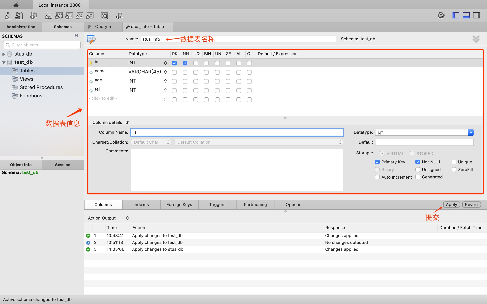

设置完成之后，可以预览当前操作的 SQL 脚本，然后单击 Apply 按钮，最后在下一个弹出的对话框中直接单击 Close 按钮，即可完成数据表 stus_info 的创建，如下图所示。

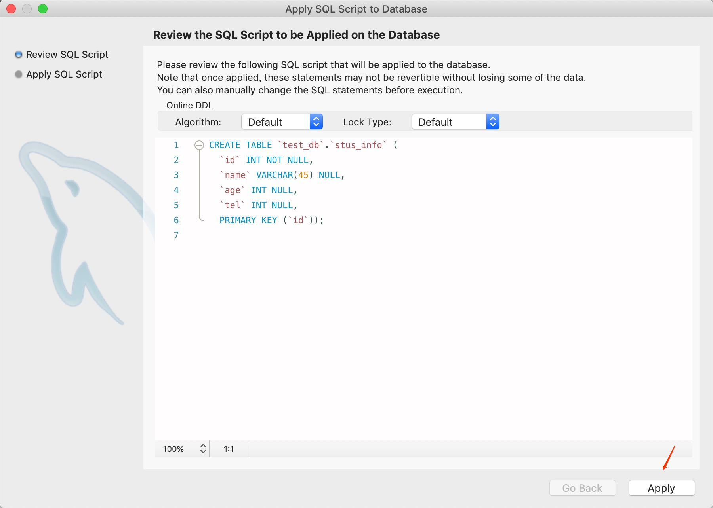

**\\.  关键字**

- PK：primary key (column is part of a pk) 主键
- NN：not null (column is nullable) 非空
- UQ：unique (column is part of a unique key) 唯一
- AI：auto increment (the column is auto incremented when rows are inserted) 自增
- BIN：Is binary column (if data is a blob or similar, this indicates that is binary data, rather than text) 存放二进制数据的列
- UN：unsigned (for integer types, see docs: “10.2. Numeric Types”) 无符号整数
- ZF：Fill up values for that column with 0's if it is numeric (rather a display related flag, see docs: “10.2. Numeric Types”)填充0位（例如指定3位小数，整数18就会变成18.000）

## 2. 查看数据表

成功创建数据表后，可以查看数据表的结构信息，在需要查看表结构的数据表上右击，选择 Table Inspector 选项，即可查看数据表的结构，当然你也可以点击如下图所示的图标查看数据表信息。

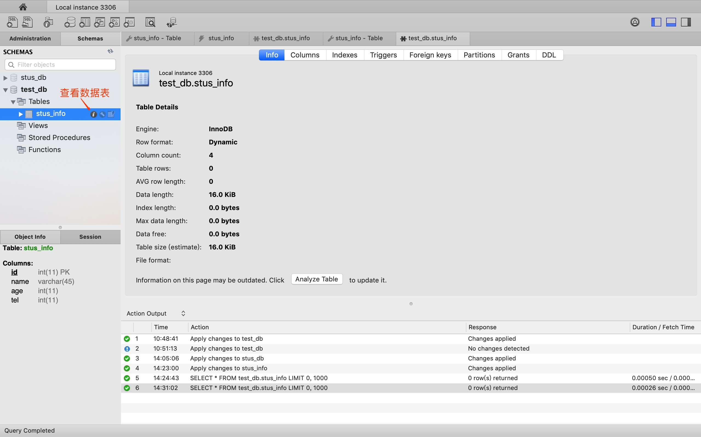

在查看数据表的对话框中，Info 标签显示了该数据表的表名、存储引擎、列数、表空间大小、创建时间、更新时间、字符集校对规则等信息。在 Columns 标签显示了该表数据列的信息，包括列名、数据类型、默认值、非空标识、字符集、校对规则和使用权限等信息...

## 3. 修改数据表

在 SCHEMAS 界面的 test_db 数据库中，在需要修改表结构的数据表上右击，选择“Alter Table…”选项，即可修改数据表的基本信息和数据表结构，当然你也可以点击如下图所示的图标修改数据表信息。

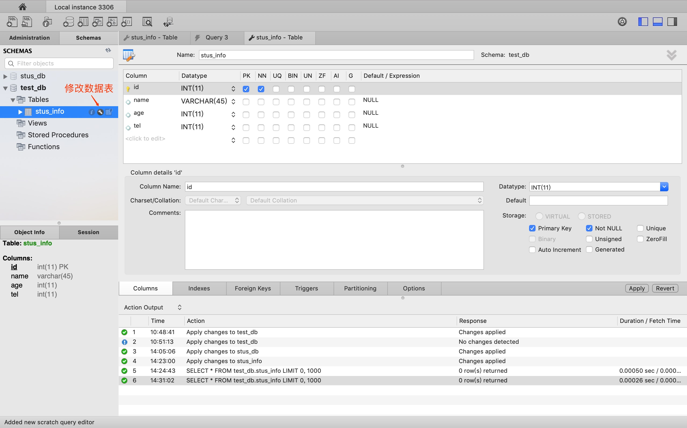

## 4. 删除数据表

可以在 SCHEMAS 中的 test_db 数据库的 Tables 列表中删除数据表，在需要删除的数据表上右击，选择“Drop Table…”，如下图所示。

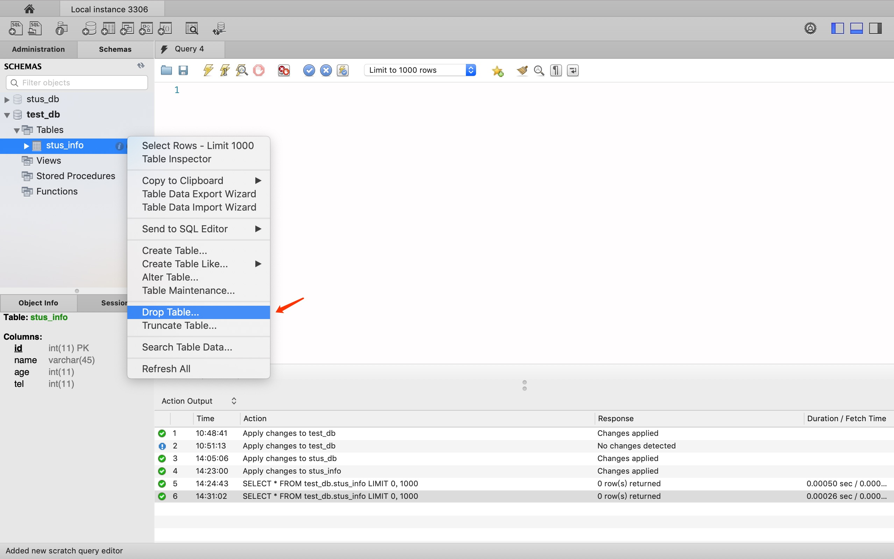

# 四、主键约束

主键表示定义的该列值在表中是唯一的意思，不可以有重复。

在 MySQL Workbench 中，在修改表的对话框中，控制 PK 列的勾选情况，即可操作数据表的主键约束，当勾选 PK 复选框时，该列就是数据表的主键；当取消勾选 PK 复选框时，则取消该列的主键约束。单击 Apply 按钮即可完成表的修改，如下图所示。

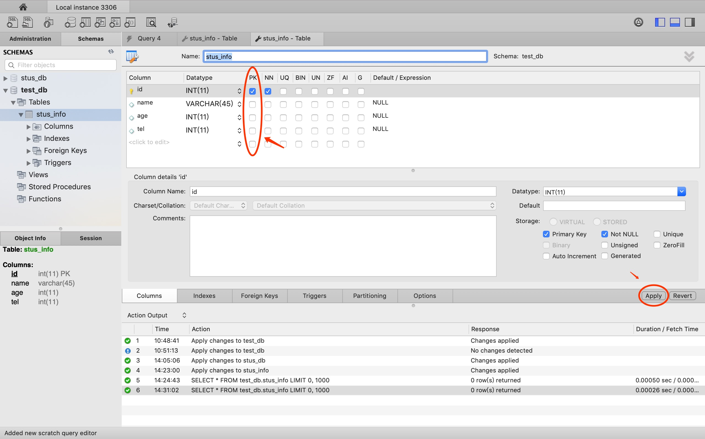

# 五、外键约束

外键是相对于主键说的，是建立表之间的联系的必须的前提。比如这里有两张表，stus（学生）表和infos（信息）表，stus中stu_num是infos中的stu_num，而stus中的stu_num依赖于infos中的stu_num。那么infos中的stu_num就是stus的外键。也就是当我们给stu_num创建一个外键，这个外键就是infos中的stu_num时，stu_num就必须与infos中stu_num一致，我们可以通过外键使两张表进行关联。

外键可以使得两张表关联，保证数据的一致性和实现一些级联操作。

简单总结就是：为了一张表记录的数据不要太过冗余；保持数据的一致性、完整性。

现在创建两张表：stus、infos

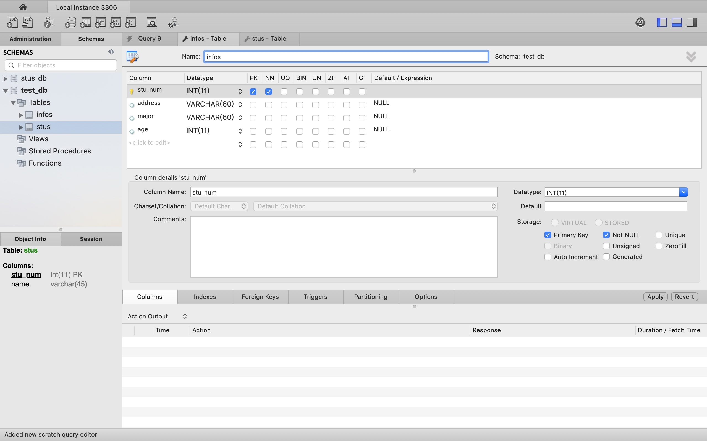

在 MySQL Workbench 中，打开修改数据表的对话框，进入 Foreign Keys 标签，首先在 Foreign Key Name 中填入外键名称，其次在 Referenced Table 中选择当前数据库中的数据表，然后选择设置外键的字段，接着选择主表的关联字段，最后单击 Apply 按钮即可完成外键的添加操作，如下图所示：

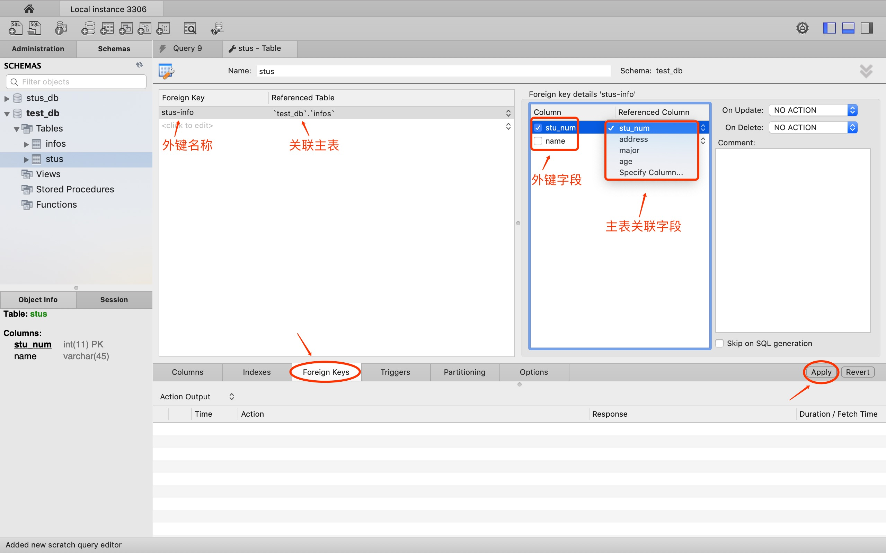

设置完成之后，可以预览当前操作的 SQL 脚本，然后单击 Apply 按钮，最后在下一个弹出的对话框中直接单击 Finish 按钮，即可完成数据表 stus 中外键的创建。

在外键约束的列表中，在需要删除的外键上右击，选择 Delete selected 选项，删除对应的外键，单击 Apply 按钮，即可完成删除，如下图所示。

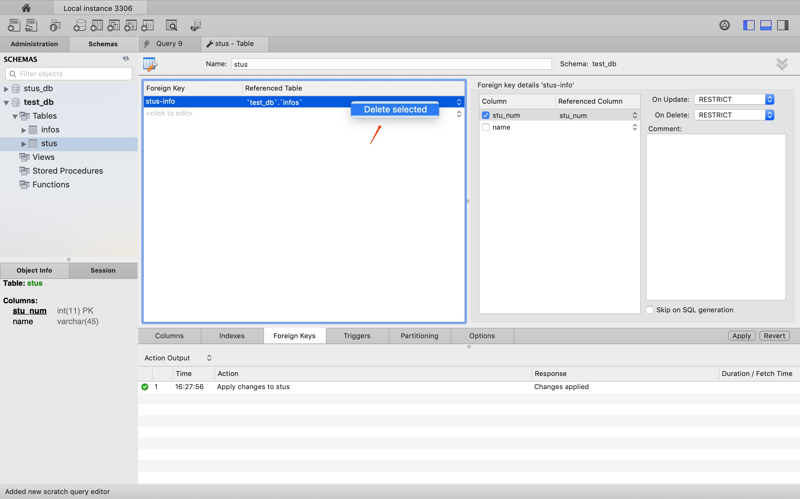

# 六、其他约束

## 1. 唯一约束

在 MySQL Workbench 中，在修改数据表的对话框中，控制 UQ 列的勾选情况，即可操作数据表的唯一约束，当勾选 UQ 复选框时，该列就是数据表的唯一约束索引；当取消勾选 UQ 复选框时，则取消该列的唯一约束索引。单击 Apply 按钮即可完成表的修改。

## 2. 默认值约束

在 MySQL Workbench 中，在修改数据表的对话框中，在 Default/Expression 列中编辑字段的默认值。单击 Apply 按钮即可完成表的修改。

## 3. 非空约束

在 MySQL Workbench 中，在修改数据表的对话框中，控制 NN 列的勾选情况，即可操作数据表的非空约束。当勾选 NN 复选框时，该列为数据表的非空约束；当取消勾选 NN 复选框时，则取消该列的非空约束。单击 Apply 按钮即可完成表的修改。

# 七、编辑表中的数据

打开 MySQL Workbench 软件，在 SCHEMAS 列表中展开当前默认的 test_db 数据库，展开 Tables 菜单，在 cars 表上右击，选择 Select Rows–Limit 1000，即可对 cars 表中的数据进行编辑操作，如下图所示。

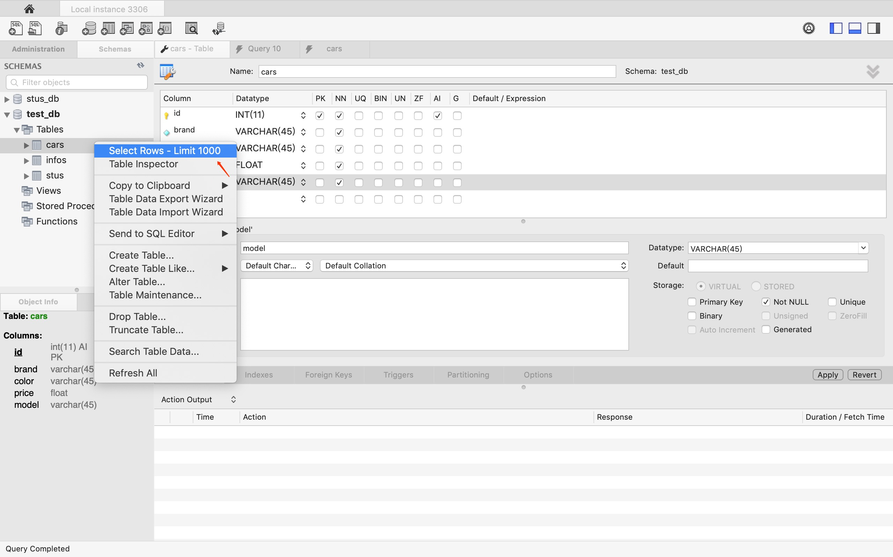

在弹出的对话框中，Edit 菜单栏中包含三个按钮，分别为“修改”“插入”和“删除”，当然你也可以双击选项框进行添加和修改。单击 Apply 按钮，即可保存修改，如下图所示:

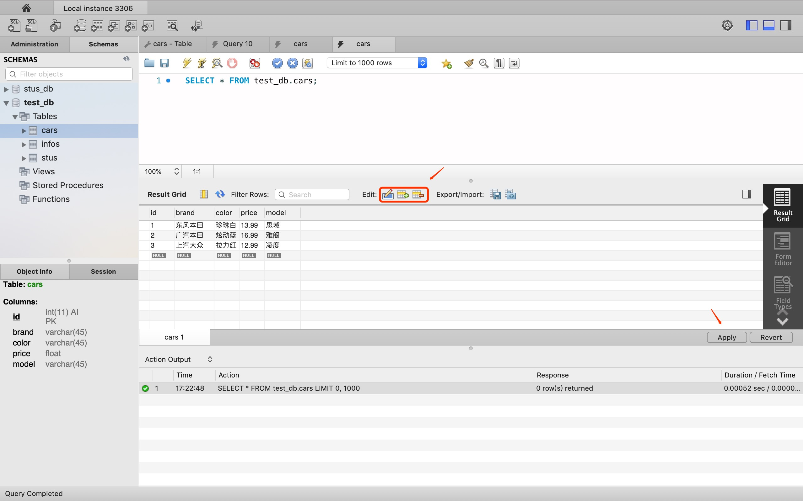

在编辑数据表的对话框中设置完成之后，可以预览当前操作的 SQL 脚本，然后单击 Apply 按钮，最后在下一个弹出的对话框中直接单击 Close 按钮，即可完成数据表 cars 中数据的修改。

# 八、用户权限

## 1. 创建用户

打开 MySQL Workbench 软件，在菜单栏中选择 Server 菜单，在展开的列表中选择 Users and Privileges 选项，进入用户和权限的管理界面，如下图所示。

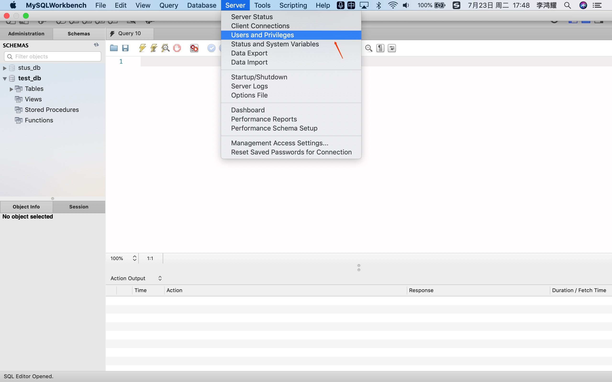

进入用户和权限的管理界面，左上角的方框中显示当前数据库中的用户列表，包括数据库系统默认的用户 mysql.session、mysql.sys、root 以及自定义的用户，同时列表中还显示用户的主机名称，如  localhost。在管理界面的左下角可以单击 Add Account 按钮，即可创建一个新用户，如下图所示。

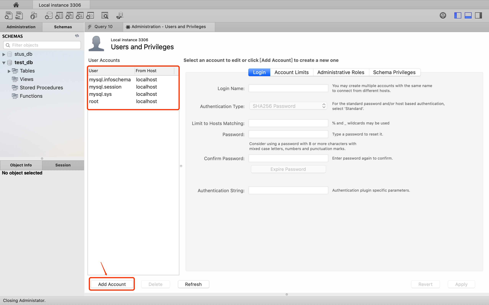

在创建用户界面，可以设置用户名称、认证类型、主机名称、用户密码和确认密码，单击 Apply 按钮，即可完成用户的创建，如下图所示。

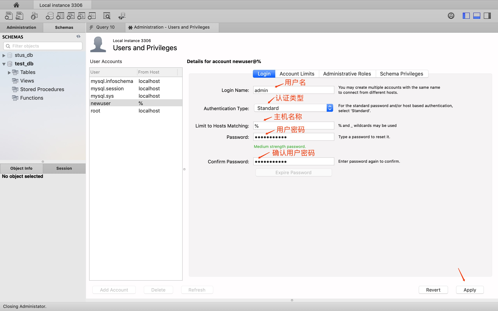

在左侧的用户列表中，选择某个用户，即可查看用户的用户名称、认证类型、主机名称、用户密码等信息。并且可以对用户信息进行修改，修改完成后单击 Apply 按钮，即可完成用户信息的修改。

## 2. 删除用户

在用户列表的下方，可以单击 Delete 按钮删除用户，单击 Refresh 按钮刷新用户的列表，如下图所示。

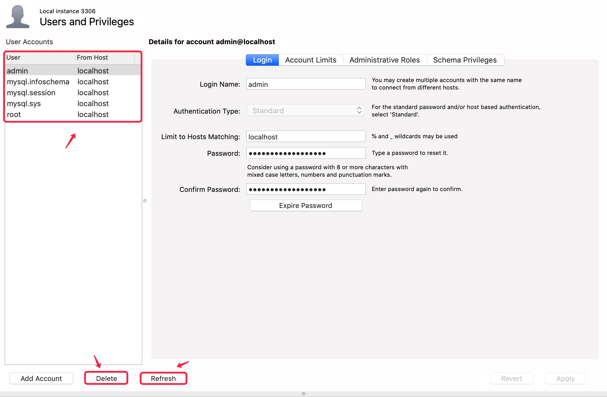

