# 一、查询数据表

mysql表单查询是指从一张表的数据中查询所需的数据，主要有查询所有字段、查询指定字段、查询指定记录、查询空值、多条件的查询、对查询结果进行排序等。

## 1. SELECT 语法

MySQL 从数据表中查询数据的基本语句为 SELECT 语句，基本格式如下

```mysql
SELECT
{* | <字段列名>}
FROM <表 1>, <表 2>…
[
  [WHERE <表达式>
  [GROUP BY <group by definition>
  [HAVING <expression> [{<operator> <expression>}…]]
  [ORDER BY <order by definition>]
  [LIMIT[<offset>,] <row count>]
]
```

其中，各条子句的含义如下：

- `{*|<字段列名>}`：包含星号通配符的字段列表，表示查询的字段，其中字段列至少包含一个字段名称，如果要查询多个字段，多个字段之间要用逗号隔开，最后一个字段后不要加逗号。
- `FROM <表 1>，<表 2>…`：表 1 和表 2 表示查询数据的来源，可以是单个或多个。
- `WHERE`： 可选项，如果选择该项，将限定查询行必须满足的查询条件。
- `GROUP BY< 字段 >`：该子句告诉 MySQL 如何显示查询出来的数据，并按照指定的字段分组。
- `[ORDER BY< 字段 >]`：该子句告诉 MySQL 按什么样的顺序显示查询出来的数据，可以进行的排序有升序（ASC）和降序（DESC）。
- `[LIMIT[<offset>，]<row count>]`：该子句告诉 MySQL 每次显示查询出来的数据条数。

## 2. 查询所有内容

在 SELECT 语句中使用星号“*”通配符查询所有字段。

SELECT 查询记录最简单的形式是从一个表中检索所有记录，实现的方法是使用星号 `*` 通配符指定查找所有列的名称，语法格式如下：

```mysql
SELECT * FROM <表名>;
```

【实例 1】从 heros 表中检索所有字段的数据，输入的 SQL 语句和执行结果如下所示。

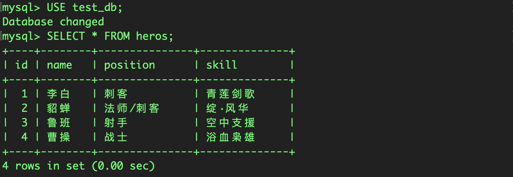

由执行结果可知，使用星号 `*` 通配符时，将返回所有列，数据列按照创建表时的顺序显示。

> 注意：一般情况下，除非需要使用表中所有的字段数据，否则最好不要使用通配符 `*` 。使用通配符虽然可以节省输入查询语句的时间，但是获取不需要的列数据通常会降低查询和所使用的应用程序的效率。通配符的优势是，当不知道所需列的名称时，可以通过通配符获取它们。

根据前面 SELECT 语句的格式，SELECT 关键字后面的字段名为将要查找的数据，因此可以将表中所有字段的名称跟在 SELECT 关键字后面，如果忘记了字段名称，可以使用 DESC 命令查看表的结构。

有时，由于表的字段可能比较多，不一定能记得所有字段的名称，因此该方法很不方便，不建议使用。

【实例2】查询 heros 表中的所有数据，输入的 SQL 语句和执行结果如下所示。

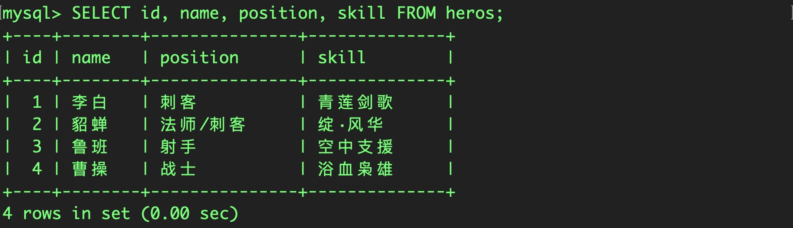

> 注意：使用 `*` 可以返回所有列的数值，但若不需要返回所有列的值，为了提高效率，一般采用 SELECT 字段名列表的形式。

## 3. 查询指定内容

查询表中的某一个字段的语法格式为：

```mysql
SELECT < 列名 > FROM < 表名 >;
```

【实例 3】查询 heros 表中 name 列所有英雄的名字，输入的 SQL 语句和执行结果如下所示。

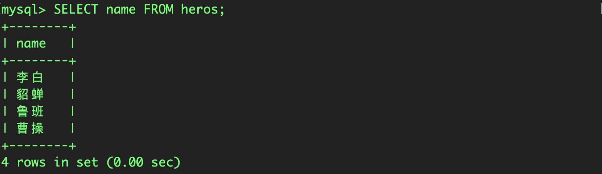

输出结果显示了 heros 表中 name 字段下的所有数据。

使用 SELECT 声明可以获取多个字段下的数据，只需要在关键字 SELECT 后面指定要查找的字段名称，不同字段名称之间用逗号 `,` 分隔开，最后一个字段后面不需要加逗号，语法格式如下：

```mysql
SELECT <字段名1>, <字段名2>, ..., <字段名n> FROM <表名>;
```

【实例 4】从 heros 表中获取 id、name 和 position 三列，输入的 SQL 语句和执行结果如下所示。

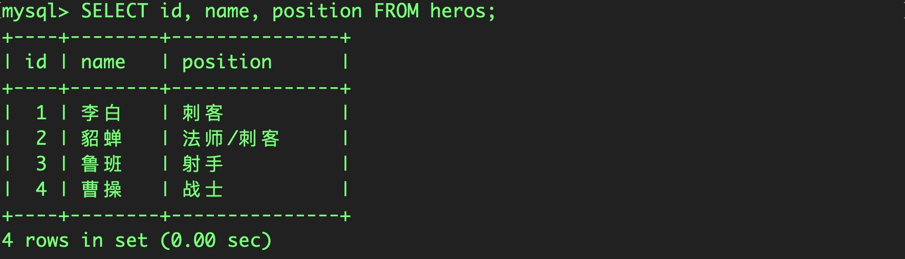

输出结果显示了 heros 表中 id、name 和 position 三个字段下的所有数据。

# 二、去重

语法形式：

```mysql
SELECT DISTINCT <字段名> FROM <表名>;
```

为了演示该实例，在 heros 数据表中修改貂蝉的 `position` 字段为 ”刺客“。

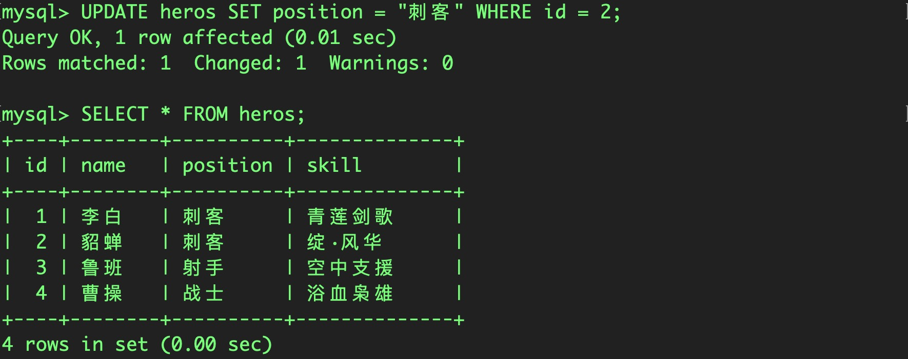

【实例1】查询heros表中的position列中的所有数据且不重复。

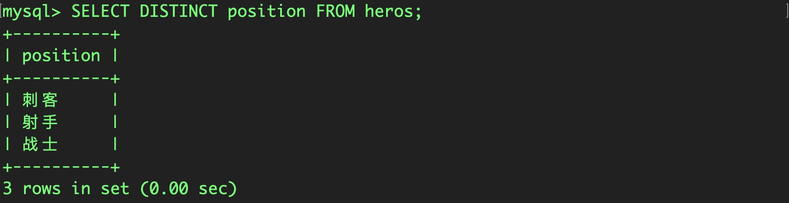

由运行结果可以看到，这次查询结果只返回了3条记录的 position 值，且没有重复的值。

# 三、设置别名

在使用mysql查询时，当表名很长或者执行一些特殊查询的时候，为了方便操作或者需要多次使用相同的表时，可以为表指定别名，用这个别名代替表原来的名称。为表取别名的基本语法格式为：

```mysql
<表名> [AS] <别名>
```

【实例 1】为 heros 表取别名 H，输入的 SQL 语句和执行结果如下所示。

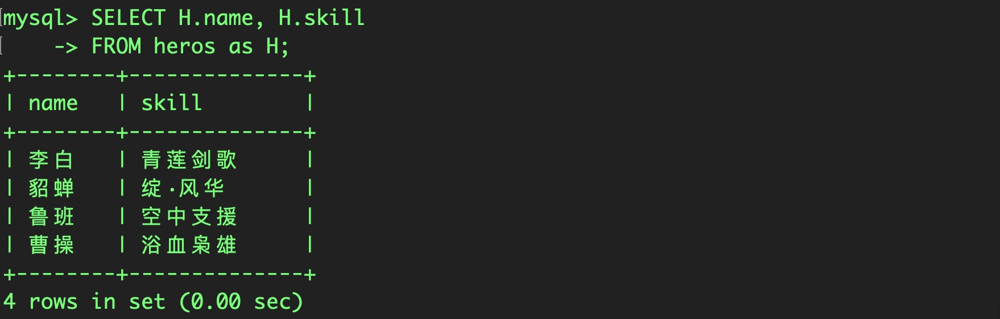

> 注意：在为表取别名时，要保证不能与数据库中的其他表的名称冲突。

在使用 SELECT 语句显示查询结果时，MySQL 会显示每个 SELECT 后面指定输出的列，在有些情况下，显示的列名称会很长或者名称不够直观，MySQL 可以指定列的别名，替换字段或表达式。

为列取别名的基本语法格式为：

```mysql
<列名> [AS] <列别名>
```

【实例 2】查询 heros 表，为 name 取别名 hero_name，为 skill 取别名hero_skill，输入的 SQL 语句和执行结果如下所示。

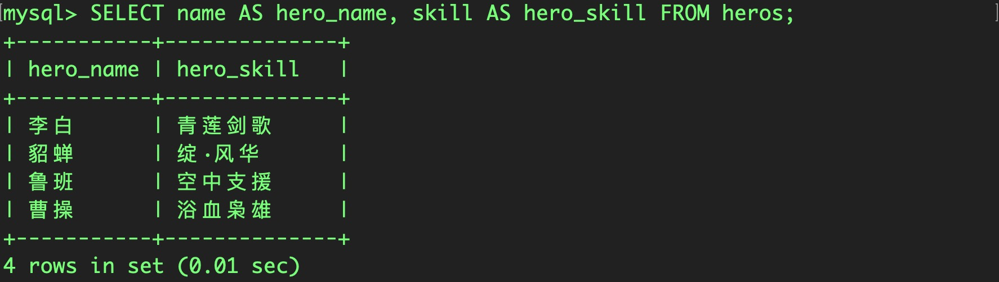

> 注意：表别名只在执行查询时使用，并不在返回结果中显示，而列定义别名之后，将返回给客户端显示，显示的结果字段为字段列的别名。

# 四、限制查询条数

在使用 mysql SELECT 语句时往往返回的是所有匹配的行，有些时候我们仅需要返回第一行或者前几行，这时候就需要用到 MySQL LIMT 子句。基本的语法格式如下：

```mysql
<LIMIT> [ <位置偏移量>, ] <行数>
```

LIMIT 接受一个或两个数字参数。参数必须是一个整数常量。如果给定两个参数，第一个参数指定第一个返回记录行的偏移量，第二个参数指定返回记录行的最大数目。

第一个参数“位置偏移量”指示 MySQL 从哪一行开始显示，是一个可选参数，如果不指定“位置偏移量”，将会从表中的第一条记录开始（第一条记录的位置偏移量是 0，第二条记录的位置偏移量是 1，以此类推）；第二个参数“行数”指示返回的记录条数。

【例 1】显示 heros 表查询结果的前 2 行，输入的 SQL 语句和执行结果如下所示。

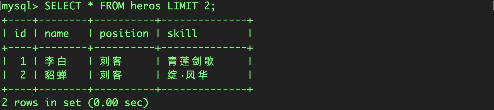

由结果可以看到，该语句没有指定返回记录的“位置偏移量”参数，显示结果从第一行开始，“行数”参数为 2，因此返回的结果为表中的前 2 行记录。

若指定返回记录的开始位置，则返回结果为从“位置偏移量”参数开始的指定行数，“行数”参数指定返回的记录条数。

【实例2】在 heros 表中，使用 LIMIT 子句返回从第 2条记录开始的行数为 2 的记录，输入的 SQL 语句和执行结果如下所示。

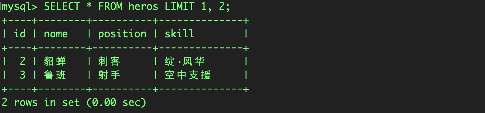

由结果可以看到，该语句指示 MySQL 返回从第 2 条记录行开始的之后的 2条记录，第一个数字“1”表示从第 2 行开始（位置偏移量从 0 开始，第 2 行的位置偏移量为 1），第二个数字 2 表示返回的行数。

所以，带一个参数的 LIMIT 指定从查询结果的首行开始，唯一的参数表示返回的行数，即“LIMIT n”与“LIMIT 0，n”等价。带两个参数的 LIMIT 可返回从任何位置开始的指定行数的数据。

返回第一行时，位置偏移量是 0。因此，“LIMIT 1，1”返回第 2 行，而不是第 1 行。

# 五、对查询结果排序

在 MYSQL SELECT 语句中，`ORDER BY` 子句主要用来将结果集中的数据按照一定的顺序进行排序。

其语法格式为：

```mysql
ORDER BY { <列名> | <表达式> | <位置> } [ASC|DESC]
```

- `列名`：指定用于排序的列。可以指定多个列，列名之间用逗号分隔。
- `表达式`：指定用于排序的表达式。
- `位置`：指定用于排序的列在 SELECT 语句结果集中的位置，通常是一个正整数。
- `ASC|DESC`：
  - ASC：升序，默认
  - DESC：降序

使用 ORDER BY 子句应该注意以下几个方面：

- ORDER BY 子句中可以包含子查询。
- 当排序的值中存在空值时，ORDER BY 子句会将该空值作为最小值来对待。
- 当在 ORDER BY 子句中指定多个列进行排序时，MySQL 会按照列的顺序从左到右依次进行排序。
- 查询的数据并没有以一种特定的顺序显示，如果没有对它们进行排序，则将根据插入到数据表中的顺序显示。使用 ORDER BY 子句对指定的列数据进行排序。

【实例 1】添加熟练度（exp）列，设置表中已有数据的熟练度值，并根据熟练度值排序：

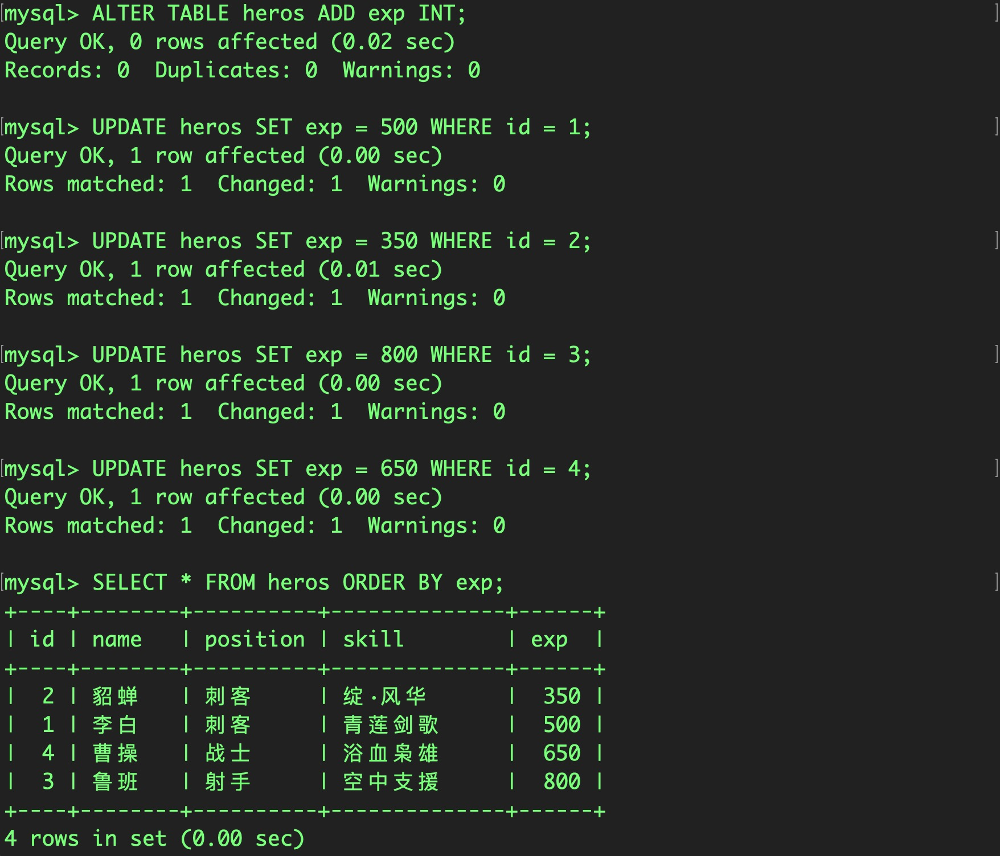

该语句通过指定 ORDER BY 子句，MySQL 对查询的 exp 列的数据按数值的大小进行了升序排序。

> 提示：有时需要根据多列进行排序。对多列数据进行排序要将需要排序的列之间用逗号隔开。

【实例 2】根据exp 降序排序：

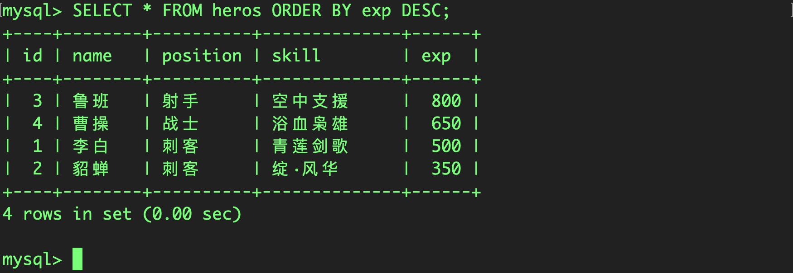

# 六、条件查询

在使用MYSQL SELECT语句时，可以使用 WHERE 子句来指定查询条件，从 FROM 子句的中间结果中选取适当的数据行，达到数据过滤的效果。语法格式如下：

```mysql
WHERE <查询条件> {<判定运算1>，<判定运算2>，…}
```

其中，判定运算其结果取值为 TRUE、FALSE 和 UNKNOWN。

判定运算的语法分类如下：

- <表达式1>`{=|<|<=|>|>=|<=>|<>|！=}`<表达式2>
- <表达式1>`[NOT]LIKE`<表达式2>
- <表达式1>`[NOT][REGEXP|RLIKE]`<表达式2>
- <表达式1>`[NOT]BETWEEN`<表达式2>`AND`<表达式3>
- <表达式1>`IS[NOT]NULL`

## 1. 单一查询

【实例 1】查询id为2的name、position字段，输入的 SQL 语句和行结果如下所示。

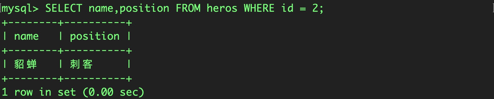

该语句采用了简单的相等过滤，查询一个指定列 id 的具体值 2。

【实例 2】查询熟练度小于等于 500 的英雄的姓名，输入的 SQL 语句和执行结果如下所示。

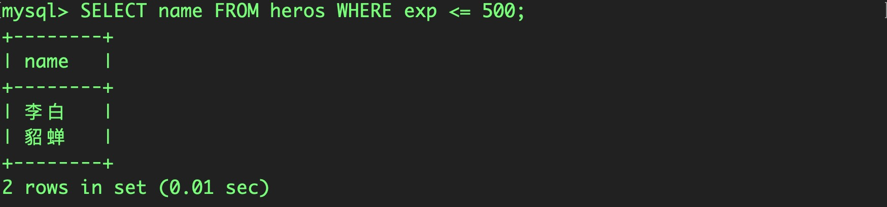

可以看到，查询结果中所有记录的 exp 字段的值均小于等于500，而大于500的记录没有被返回。

## 2. 多条件查询

使用 SELECT 查询时，可以增加查询的限制条件，这样可以使查询的结果更加精确。MySQL 在 WHERE 子句中使用 AND 操作符限定只有满足所有查询条件的记录才会被返回。可以使用 AND 连接两个甚至多个查询条件，多个条件表达式之间用 AND 分开。

【实例 3】查询熟练度>= 500 并且职业为射手的影响的name值，输入的 SQL 语句和执行结果如下所示。

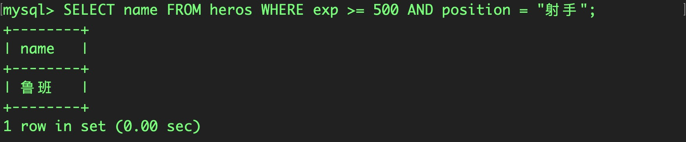

> 注意：上例的 WHERE 子句中只包含一个 AND 语句，把两个过滤条件组合在一起，实际上可以添加多个 AND 过滤条件，增加条件的同时增加一个 AND 关键字。

## 3. LIKE 模糊查询

字符串匹配的语法格式如下：

```mysql
<表达式1> [NOT] LIKE <表达式2>
```

字符串匹配是一种模式匹配，使用运算符 LIKE 设置过滤条件，过滤条件使用通配符进行匹配运算，而不是判断是否相等进行比较。

相互间进行匹配运算的对象可以是 CHAR、VARCHAR、TEXT、DATETIME 等数据类型。运算返回的结果是 TRUE 或 FALSE。

利用通配符可以在不完全确定比较值的情形下创建一个比较特定数据的搜索模式，并置于关键字 LIKE 之后。可以在搜索模式的任意位置使用通配符，并且可以使用多个通配符。MySQL 支持的通配符有以下两种：

### 3.1. 百分号（%）

百分号是 MySQL 中常用的一种通配符，在过滤条件中，百分号可以表示任何字符串，并且该字符串可以出现任意次。
使用百分号通配符要注意以下几点：

- MySQL 默认是不区分大小写的，若要区分大小写，则需要更换字符集的校对规则。
- 百分号不匹配空值。
- 百分号可以代表搜索模式中给定位置的 0 个、1 个或多个字符。
- 尾空格可能会干扰通配符的匹配，一般可以在搜索模式的最后附加一个百分号。

### 3.2. 下划线（ _ ）

下划线通配符和百分号通配符的用途一样，下画线只匹配单个字符，而不是多个字符，也不是 0 个字符。

> 注意：不要过度使用通配符，对通配符检索的处理一般会比其他检索方式花费更长的时间。

便于实例展示，在heros表中，再添加两条数据：

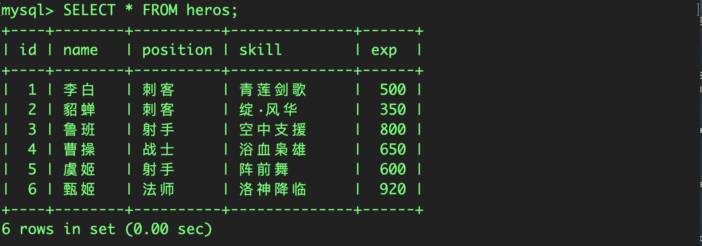

【实例 4】在heros表中，查询name以`姬`字结尾的信息：


> 注意：在搜索匹配时，通配符“%”可以放在不同位置。你也可以通过 `%指定字符%` 来条件查询对应记录中包含某个字段信息的数据。

【实例 5】在heros表中，查询 `00`结尾，前面只有一个字符的数据：

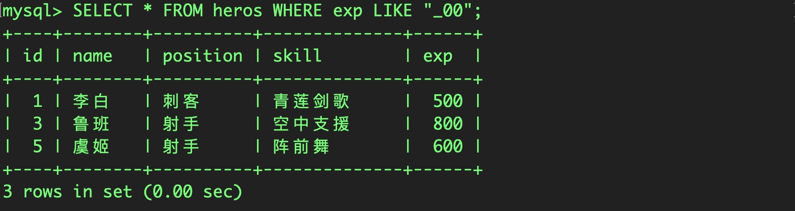

## 4. 根据日期查询

以日期字段作为条件，可以使用比较运算符设置查询条件，也可以使用 BETWEEN AND 运算符查询某个范围内的值。

BETWEEN AND 用来查询某个范围内的值，该操作符需要两个参数，即范围的开始值和结束值，若字段值满足指定的范围查询条件，则这些记录被返回。

为了演示实例，在heros表中添加 `last_use_date`字段，记录最后一次使用该英雄的时间：

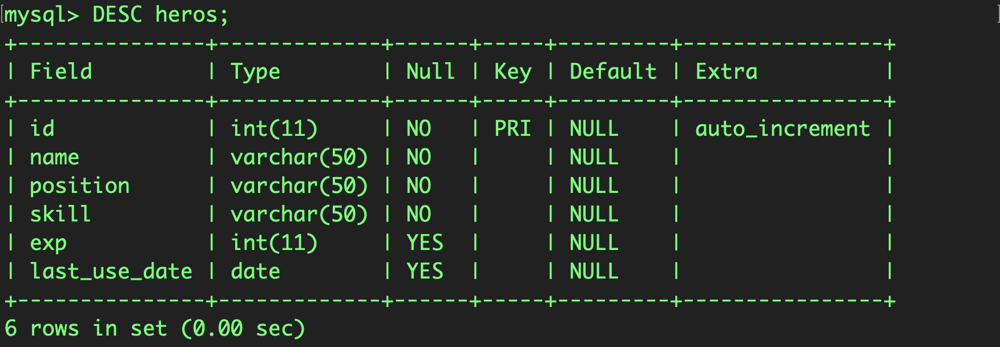

并添加对应的数据：

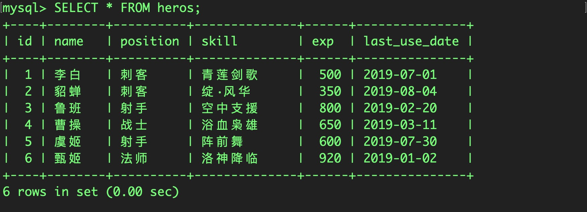

【实例 6】在表 heros 中查询注册日期在 2016-7-1 之前的使用英雄的信息，输入的 SQL 语句和执行结果如下所示。

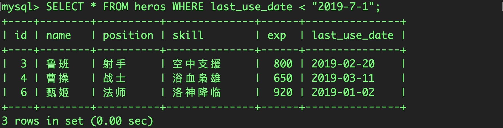

【实例 7】在表 heros 中查询使用日期在 2019-3-1 和 2019-8-1 之间的学生的信息，输入的 SQL 语句和执行结果如下所示。

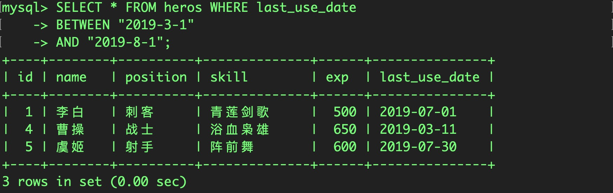


